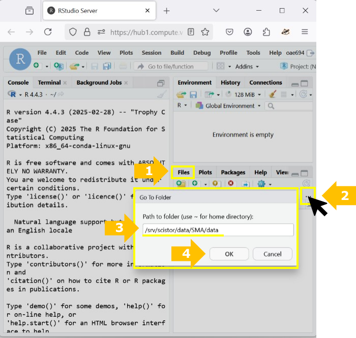

```{r opts, echo = FALSE}
knitr::opts_chunk$set(message=FALSE, warning=FALSE, fig.path = "img/")
```

VU Amsterdam

# Introduction

This week:

1. We will introduce a R-markdown as a type of R-script.
2. We will give you a refresher on working with the **R programming language**.
3. We will get you started working with text analysis in R. 

For the second poiny, we will work with `tidyverse` For the third, we will give you a glimpse **under-the-hood** of common text analysis techniques using `tidytext`.

In the previous practical about **validity** you saw that it cannot be taken for granted that an automated analysis accurately measures what we actually want to measure.

In this and the coming lectures, we will deepen this understanding by looking closer at how computers actually perform these measurements.
This will help you develop a better intuition for what we can and cannot do with automated analyses of texts.

You will also get first-hand experience with the practice of *data science*, which is a [growing specialization among social scientists](https://campus.sagepub.com/blog/data-science-survey) in both academia and business.
This will help you determine *whether* this is a direction that you'd like to pursue.
And even if you come to the conclusion that programming is definitely not your cup of tea, it's still valuable to have walked some miles in the shoes of a programmer.
This course thereby follows the recommendation of [Van Atteveldt & Peng (2018)](https://www.tandfonline.com/doi/full/10.1080/19312458.2018.1458084) to at least "stimulate and facilitate" the learning of computational skills:

> Not everyone can (or should) become a programmer, but modern computer languages, libraries, and toolkits have made it easier than ever to achieve useful results, and with a relatively limited investment in computing skills one can quickly become more productive at data driven research and better at communicating with programmers or computer scientists.
> We think it is vital that we make computational methods more prominent in our teaching to make sure the new generation of communication scientists and practitioners are stimulated and facilitated to learn computational skills such as data analytics, text processing, or web scraping, as applicable.
> (p. 87-88)

# 1. R-markdown: How to work with the R tutorial documents

As you probably noticed, the format of this tutorial is somewhat different from previous weeks. Before the tutorials were PDF files, but now it's this HTML document. Long story short, these tutorial documents are themselves generated in R (using [R-Markdown](https://rmarkdown.rstudio.com/)).
This guarantees that any code shown here does actually work.
So, as long as you copy/paste all the code from this tutorial, and execute it in the same order as we showed it in the tutorial, everything *should* work.

We say *should*, because you will most likely run into *some* errors.
Even if the code itself is correct, things can still go wrong due to different (versions of) software and if the code is not executed in the right order.
Think of it as a recipe: you can still mess it up if you use the wrong equipment or ingredients, or if you perform steps in the wrong order.


## 1.A. Preparing the R-markdown script

If you have questions regarding how to use R-markdown, we suggest you do one of the following things. 

First, when you do run into an error, don't panic!
Nobody writes perfect code, and one of the key skills of a data scientist is to learn how to solve errors.
In [this Google Doc](https://docs.google.com/document/d/1aPV1LqFoRkQEc5oDsOE2QQSytVO8eEwxV1P0A9oOUqQ/edit?usp=sharing) we provide some general tips.
When in class, you can of course consult your teacher, so if you find yourself struggling, it is recommended to prepare your assignment well before class, so that you have more time to ask questions

Second option, R developers tend to document their packages very well. So, if you go the the "Packages" panel and you search for a package, in this case `rmarkdown`, you will find some useful documentation. So, go ahead and click on the "Vignettes and other documentation" url of the `rmarkdown` package panel. From there, click on `rmarkdown::rmarkdown`. This will display some tutorials on how to efficiently use R-markdown.

The third option is that you look for the package's "Cheatsheet". Nowadays, many R-developers offer infographics with the most useful functions and parameters of their packages. To access these Cheatsheets you can go to the RStudio header and then click "Help/Cheat Sheets/R Markdown cheatsheet". Alternatively, you can open your favorite browser (e.g. DuckDuckGo, Chrome, and Mozilla) and search for the package's Cheatsheet.

Now, using any of the resources mentioned above, do the following: 

1. Look for the way you can insert a code chunk.
2. Inside the code chunk, add the following lines of code `rm(list=ls())` and `gc()`. 
3. Look for the way you can run the code chunk.

From the second step, `rm(list=ls())` will clean the R environment, so that you do not drag any variables from previous R-sessions. The second line (`gc()`) will make sure that those variables do not occupy your computers' RAM anymore.

**Exercise 1.1:** Chunk to clean the memory

```{r Exercise 1.1}

rm(list=ls())
gc()

```

As you will be working with processes that can take as long as 2 hours, we recommend that you run those scripts and save the results in your computer as a csv or as a table. Once you have done it, you can use the parameter `eval=FALSE` of the chunk to NOT RUN again the code in those particular chunks!

**Exercise 1.2:** Use the parameter `eval=FALSE` to not run the following chunk when you render your R-markdown file.

```{r Exercise 1.2}

cat("This function should NOT RUN when you render your sript, but I should still be able to see this code.")

```


**Exercise 1.3:** What other parameters would you use to get a nicer html, pdf, or word after rendering your script? Check the R-markdown documentation and write them down here:


# 2. What is R?

As you may remember from previous courses, R is an open-source statistical software language, that is in particular popular among computational social scientists. R is not the same as RStudio. R is the programming language, while RStudio is a software to interact with R in an easier way.

R increasingly replaces more traditional proprietary statistics software such as SPSS and Stata. This has several main reasons:

-   R is a programming language, which makes it more versatile. While R focuses on statistical analysis at heart, it facilitates a wide-range of features, ranging from [text analysis]() to advanced [visualizations](https://www.r-graph-gallery.com/).
-   The range of things you can do with R is constantly being updated. R is open-source, meaning that anyone can contribute to its development. In particular, people can develop new *packages*, that can easily and safely be installed from within R with a single command. Since many scholars and industry professionals use R, it is constantly kept up-to-date.
-   R is free. While for students this is not yet a big deal due to university discounts for various statistics software, this can be a big plus in the commercial sector. Especially for small businesses and free-lancers.

## 2.A. Getting started with R and RStudio

> If you already installed and played around with R and RStudio in the homework assignment, you can skip this part and go straight to section 2.B.

To get started with R, you will need to install two (free) pieces of software.

-   *R* is the actual R software that is used to run R code. Technically, this is all you need, but by itself R is not very nice to work with. Rather than using R by itself, it's therefore common to also install a `graphical user interface` (GUI).
-   *RStudio* is the most popular GUI for R. It makes working with R a lot easier and more pleasant.

You won't need to run these two pieces of software side-by-side.
When you open RStudio, it will automatically also open R.
Both programs can be downloaded for free, and are available for all main operating systems (Windows, macOS and Linux).

### 2.A.1 Installing R

To install R, you can download it from the [CRAN (comprehensive R Archive Network) website](https://cran.r-project.org/).
**Do not be alarmed** by the website's 90's aesthetics.
R itself is cold, dry, no-nonsense software, and the website kind of reflects that.
When you're working with R, you'll actually be using RStudio (as we'll install next), which makes everything much prettier and nicer.
In previous years we also noticed that some students worry about how safe the website is, since it looks so...
old.
But yes, this is the official R website, and it can definitely be trusted.

If you have trouble with the download instructions, you can use [this link](https://www.datacamp.com/community/tutorials/installing-R-windows-mac-ubuntu) for additional instructions with pictures.

### 2.A.2 Installing RStudio

The [RStudio website](https://www.rstudio.com/) contains download links and installing instructions.
You will need to install the free *RStudio Desktop Open Source License*.
This website is decidedly more user friendly, but if you have trouble figuring out which links to click, [this guide](%5Bthis%20link%5D(https://www.datacamp.com/community/tutorials/installing-R-windows-mac-ubuntu)) again can help.

Note that while you can also get paid licenses for RStudio, these are not required for *using* RStudio.
R and RStudio are free to use for both academic and [commercial purposes]((https://opensource.org/faq#osd)).

## 2.B What if I have problems with R?

Although R works on all operating systems (Windows, macOS, Linux), there are rare cases where it can be difficult to install R, or to install certain packages. It can also happen that your computer doesn't have enough resources to run certain exercises. 

Whenever you run into any of those problems, please notify your teacher, and we'll try to make it work.

Although R works on almost every system, in the unlikely case that we can't get R to work on your computer, you don't have to worry. You can use the Social Media Analytics [JupyterHub](https://hub.compute.vu.nl/) environment. To upload and download files, you can follow this [tutorial](https://societal-analytics.nl/blogs/20250201_computing-power/).

This JupyterHub can also be used if your computer has a RAM smaller than 16GB.
This setup includes the lasts versions of R and RStudio.

The data you will use during Q5 is stored in: `/srv/scistor/data/SMA/data`

To access the Q5 data, you can follow the steps in the image beneath:



<!-- [run R from the cloud](https://rstudio.cloud/plans/free), which is free for up to 25-hours per month. -->

<!-- This should mainly be used for practice, as we recommend doing the assignments on a personal (teammate's) computer. -->

<!-- If there are many people in the team who can't get R to work, you can contact the course coordinator (Kasper Welbers) for an alternative solution. -->

# 3. Basics of working with `tidyverse`

[Tidyverse](https://tidyverse.org/) is a package of packages, where all the packages share an underlying design philosophy, grammar, and data structures. In this tutorial, we will focus on three of them `dplyr`, `ggplot2`, and `stringr`.

**Exercise 3.a:** Insert a code chunk to install and load the package `tidyverse`. Hint: Use the functions `install.package()` and `library()`. Remember that you search for the function in the help panel, if you need more information on how to use it. 

```{r load tidyverse}

# install.packages(tidyverse)

library(tidyverse)

```

## Tibbles

According to the `tidyverse` developers:
> A [tibble](https://tibble.tidyverse.org/), or tbl_df , is a modern re-imagining of the data frame, keeping what time has proven to be effective, and throwing out what is not. Tibbles are data.

So, we will use `tibbles` as a way to interact with `data.frame()`. For this section of the practical, we will work with the data frame *iris*. The data frame *iris* belongs to the Base R package, you just need to call it to start using it. However, we will save it in a different variable as a `tibble`:

```{r Loading iris}

IRIS<-tibble(iris)

```

To check what is in the data frame *IRIS*, we can now just call it:

```{r Checking iris}

IRIS

```

As you can see in the console, `tibble` reports back the most important elements of your data frame. 

**Exercise 3.b:** Answer the following questions by checking the elements of your tibble:

1. How many rows and columns does your data frame have?
2. What are the names of your columns?
3. What type of data is stored in each column?

Remember that R is case sensitive, so if you need to double check the names of the variables/ columns, you can use the function `names()`:

```{r Checking the variables}

names(IRIS)

```

## Pipe `%>%` or `%|>%`

An important function from  `tidyverse` is the pipe `%>%`, also called `|>`. This function takes the output from the previous function and uses it as input for the next one. Let's show an example of its usage:

```{r Pipe}

IRIS%>%
  names()

```

In the previous code, we are simply passing the tibble IRIS as the main parameter to the function `names()`.

From here onward, we will continue using the pipe to pass outputs to the functions.

# 4 Data handling with `dplyr`

[Dplyr](https://dplyr.tidyverse.org/) is a powerful, fast, and user-friendly R package designed for data manipulation and wrangling, often described as a "grammar of data manipulation". 

Dplyr provides a consistent set of "verbs" (functions) to solve common data challenges. You can check all of them in their webpage, but you can also check its [Cheat Sheet](https://rstudio.github.io/cheatsheets/data-transformation.pdf). 

For this practical, we will focus on `Dplyr`'s main functions:
* `filter()`: Keep or drop *rows* that match a condition.
* `select()`: Keep or drop *columns* using their names and types.
* `arrange()`: Order rows using column values.
* `mutate()`: Create, modify, and delete columns.
* `summarise()`: Summarise each group down to one row.
* `group_by()`: Take an existing data frame and converts it into a grouped data frame where operations are performed "by group".


## 4.1 Using `filter()`

This function is used to subset a data frame, applying the expressions in "..." to determine which rows should be kept.

In its core, this function creates a logical vector. So, if you want to keep the opposite, then you can use the operator “!”.

Let’s say that you want to keep only the elements in the column `Species` that are equal to “setosa”:

```{r Filter example}

filter(IRIS,Species=="setosa")

## This is equivalent to:

IRIS%>%
  filter(Species=="setosa")

```

To write logical expressions, you can use the special functions:

* `==`: Is the element on the left equal to the element on the right?
* `>=`: Is the element on the left bigger or equal than the element on the right?
* `<=`: Is the element on the left smaller or equal than the element on the right?
* `!=`: Is the element on the left different than the element on the right?
* `>`: Is the element on the left bigger than the element on the right?
* `<`: Is the element on the left smaller than the element on the right?

**Exercise 4.1.a:** From the IRIS data frame keep only those rows where `Petal.Width` is smaller or equal than its mean. For this, pass IRIS to `filter()` using the pipe `%>%`. Hint: Use `mean(Petal.Width)` to get the mean of `Petal.Width`. 


## 4.2 Using `arrange()`

This functions orders the rows of a data frame by the values of selected columns.

As an example, we will order the data frame by the `Petal.Width` values. At the end, we pass the resulting data frame to the function `View()` so that you can see the changes.

First, we do so in ascending order. This is how the code would look, if we do not use the pipe function:

```{r arrange ascending}

View(arrange(IRIS, Petal.Width))

```

If we use the pipe then the code would be:

```{r arrange ascending W pipe}

IRIS%>% 
  # 1. We pass the IRIS data to the function arrange
  arrange(Petal.Width)%>% 
  # 2. We pass the result from using arrange to the function View
  View()

```

As you see, using the pipe allows for an easier reading of the code. 

Second, we do so in descending order:
```{r arrange descending}

IRIS%>%
  arrange(desc(Petal.Width))%>%
  View()

```

**Exercise 4.2.a:** Arrange the IRIS data frame in descending order by `Petal.Length`.


## 4.3 Using `mutate()`

`mutate()` creates new columns that are functions of existing variables. It can also modify (if the name is the same as an existing column) and delete columns (by setting their value to NULL).

As example, let’s say that you want to add 2 to the column `Sepal.Width`:

```{r mutate}

IRIS%>%
  mutate(Sepal.Width2= Sepal.Width+2)%>%
  View()

```

In the example, `mutate()` does the following:

1. Creates the new column.
2. Then it stores in each element the result of performing the operation.

**Exercise 4.3.a:** Create a new columns called `MEAN_Petal.Length` where you store the mean of the variable `Petal.Length`. Hint: Apply the function `mean()` to the variable `Petal.Length`.


## 4.4 Using `summarise()`

`summarise()` or `summarize()`: creates a new data frame. It returns one row for each combination of grouping variables; if there are no grouping variables, the output will have a single row summarizing all observations in the input. It will contain one column for each grouping variable and one column for each of the summary statistics that you have specified.

As example, let’s say that you want to get the minimum of the columns `Sepal.Length` and `Sepal.Width`:

```{r summarise}

IRIS%>%
  summarise(min(Sepal.Length),min(Sepal.Width))

```

As you can see in the result, `summarise()` returned one single row with the minimum of each column/ variable. This is different from using `mutate()`, where you would have gotten a new column/ variable where the minimum repeats in each element:

```{r summarise vs mutate}

IRIS%>%
  mutate(min(Sepal.Length),min(Sepal.Width))%>%
  View()

```

**Exercise 4.4.a:** Obtain the maximum of all the numerical columns. Hint: Use the function `max()`.


## 4.5 Using`group_by()`

Most data operations are done on groups defined by variables. `group_by()` takes an existing tibble and converts it into a grouped tibble where operations are performed "by group".

As example, let’s say that you want to get the minimum of the columns `Sepal.Length` and `Sepal.Width` by Species:

```{r summarise by group}

IRIS%>%
  # 1. We tell R that the following transformations should be done by group:
  group_by(Species)%>%
  # 2. We perform the transformations:
  summarise(min(Sepal.Length),min(Sepal.Width))

```

As you can see, now you got one row per `Specie`'s category ("setosa", "versicolor", and "virginica"). Each row represents the minimum value of `Sepal.Length` and `Sepal.Width` per category, i.e. per group.

**Exercise 4.5.a:** Obtain the maximum of all the numerical columns per `Specie`'s category.


## 5.Data visualization with `ggplot2`

`ggplot2` is a package for creating graphs, which follows the grammar of graphs.

**What is the grammar of graphs?** The grammar of graphs tells us that:
> "... Every statistical graph is a mapping of data to a set of geometric objects (points, lines, bars) that contain aesthetic attributes (color, shape, size). The graph can even have statistical transformations of the data, and these are drawn on a specific Cartesian plane." [link](https://doi.org/10.1007/978-3-319-24277-4)

Based on the grammar of graphs, the Components of a graph are:

1. Data is the foundation of every graphic. The system works best if the data is provided in a tidy format, which briefly means a rectangular data frame structure where rows are observations and columns are variables.
2. The mapping of a plot is a set of instructions on how parts of the data are mapped onto aesthetic attributes of geometric objects. It is the ‘dictionary’ to translate tidy data to the graphics system.
3. Layers made of geometric objects (which we'll call geoms) and statistical transformations (which we'll call stats). Geoms represent what you see on the graph: points, lines, polygons, etc. Stats are a summary of the data being observed.
4. Scales maps the values of the data to values in an aesthetic space, such as color, size, or shape. Scales draws the legends or axes, which provides reverse mapping that makes it possible to read the original data from the graph.
5. The facet specification describes how to divide data into subsets and how to display it in subgraphs within the same graph. This is also called a conditioner.
6. A theme controls the points that are displayed, such as font size and color.


Let's us briefly explore each element.


## 6.Text handling with `stringr`


# 4. Text analysis in R

Earlier we showed that we can make wordclouds in R.
To do so, we used the following syntax:

```{r, eval=F}
wordcloud("A very lame wordcloud", colors="blue")
```

If you tried to run this code yourself, you probably got an error saying: `could not find function "wordcloud"`.
Don't worry, you'll be able to do this in a minute, but let's first talk a bit about what this error is saying.
Two things require clarification:

-   What is a function?
-   Why can't I find the `wordcloud` function, but you can?

For now, we'll settle for a very simple, practical definition of functions.
We can think of a function simply as a tool that given some `input` creates some `output`.
The `wordcloud` function takes as input any piece of text, and as output creates an image of a wordcloud.
Above we also saw the `sum` function, which takes as input some numbers, and as output gives the sum of these numbers.
You can recognize a function as a name followed by parentheses, e.g., `wordcloud("some text", colors="blue")`, `sum(1,2,3)`.
The parts between the parentheses contains the input to the function.

These parts are also called the `arguments` of the function, and if there are multiple arguments then they are always separated by commas.

```{r, eval=F}
function_name(argument1 = ..., argument2 = ...)
```

When we used the `wordcloud` function above we used two arguments.
The first argument is the text of which we want to make a wordcloud.
This argument is mandatory (we can't really make a wordcloud without a text, after all).
The second argument is `colors='blue'`.
which tells R that we want to use the color "blue".
This is an optional argument, and if we don't provide it a default color ('black') will be used.
For this course you mainly need to be able to recognize when a function is used, and what the arguments are.
If you want to learn more, or have trouble understanding function, we provide [additional instructions](https://github.com/ccs-amsterdam/r-course-material/blob/master/tutorials/R_basics_2_data_and_functions.md) here (see Functions section).

Working with functions is at the hearth of any analysis in R.
We start with some data as input, and then use all sorts of functions to do stuff with this data.
So you can imagine that functions are super useful.
As long as we have a function to do what we want, we can just plug our data into this function as input, and obtain our results as output!

So where do we get these super useful functions?
Surely, R doesn't just contain millions of functions?
Indeed, R itself does not, but there does exist A HUGE COLLECTION of functions that we can quite easily obtain.
These functions are available in `packages` that we can download and install into R (kind of like an app-store).

#### Installing packages

To use the `wordcloud` function, we first need to install the `tm` and `wordcloud` packages.
We can do this with the following lines of code.
Note that you **need** to put `"tm"` and `"wordcloud"` between quotation marks!

```{r, eval=F}
install.packages("tm")
install.packages("wordcloud")
```

> Sometimes R asks you a question when trying to install a package.
> You should then answer the question by typing the answer in the console (the bottom left window) and pressing enter.
> Most commonly, if you are a macOS user, you might get the question whether you want to install the package from source.
> In this case your should enter “n” or “no” in your console (“yes” only works if you have certain software installed).

This should have installed the tm and wordcloud package (if you got an error, consult your teacher).
It is now stored on your computer in a special `library` for your R packages.
Note that you do not need to run this line of code again next time that you want to use the wordcloud package.
So whenever you installed a package, you can remove the line of code from your script.

Now that you have the package, we can *almost* use the wordcloud function.
The package is in your `library`, but we still need to tell R to retrieve the package from your library to use it in your current session.
To do so, we need to say `library(package name)`.
Note that this time you **SHOULD NOT** put `wordcloud` between quotation marks.

```{r}
library(wordcloud)
```

And now we can finally use the function.

```{r, eval=F}
wordcloud("Now we can finally, finally use this function")
```

One final thing to note is that a package often contains multiple functions.
The `wordcloud` package also provides functions like `textplot`.
So remember that functions and packages are not the same thing.
A single package can provide many functions.
Whenever you open this package with `library(package)`, all these functions become available.

# Assignment 1: R syntax basics

In this first assignment we'll practice with how you'll mainly be working with R code in this course.

-   We provide some code that you copy to your script.
-   Then we'll provide some explanation of how the code works, and ask you to make some changes.
-   You then run the code, and report the results.

Part of the challenge is that you might have to try different things.
Off course, if you get stuck, you can ask your teacher, but please don't give up too early.

Copy the following code to your script:

```{r barplot, fig.align='center'}
teammembers = c("Anna", "Bob", "Steve")
heights = c(1.60, 1.80, 1.72)

barplot(heights, names.arg = teammembers, ylab='Height')
```

If you run the code, you see that it creates a Bar graph showing the heights of team members Anna, Bob and Steve.
To represent the names and heights of the team members, we created two `vectors`: **teammembers** and **heights**.
A vector in R is a collection of multiple values.
With the `c` (= combine) function we combine multiple values, separated by commas, into a vector: `c(value, value, value)`.
So with `teammembers = c("Anna", "Bob", "Steve")` we created a vector with the names of these three people.
The order of values in a vector matters.
So we know that the first value in `heights` (1.60) corresponds to the first value in `teammembers` (Anna).

> **Question 1.a**.
> Change the code so that it contains the names and heights of all your team members.
> Report your R code, and add a screenshot of the Bar graph.

In the code `barplot(heights, names.arg = teammembers, ylab='Height')`, we also specified that the label of the y-axis should be "Height".
We did this by giving an `argument` to the function.
Here the argument was `ylab` (short for y-axis label), and with `ylab="Height"` we said that the y-axis label should be "Height".

> **Question 1.b**.
> Next to the y-axis, we can also provide a label for the x-axis in the plot, using the `xlab` argument.
> Please specify that the x-axis label should be "Team members".
> Report the R code (you don't need to provide another screenshot)

Now, you figured this is a pretty boring Bar chart, so you wanted to add some colors.
You found out that there is an argument for the `barplot` function, named `col`, that allows you to give colors to bars, using any one of [these color names](https://www.r-graph-gallery.com/42-colors-names).
If the value of the `col` argument is a vector of color names, it will give specific colors to each bar.

You decide to give every bar the favourite color of the respective teammember.
We're going to do this in two steps:

> **Question 1.c**.
> First create (assign) a new vector named `colornames` that contains these colors.
> (hint: this is just like how we made the `teammembers` vector above).
> Report your code.

> **Question 1.d**.
> Second, give the `colornames` vector to the `col` argument in the barplot function.
> Provide a screenshot of the new colourful Bar chart as your answer.

# Text Analysis in R

Now we're going to use a popular package for text analysis in R, called `quanteda`.
As the first step, we're going to be installing this package.

In general, most R packages can be installed without any issues.
However, some of the more complicated packages might require some additional steps.
If you just installed the most recent version of R, you should be fine with installing quanteda.
But if you run into any issues, please have a look at the instructions [here](https://quanteda.io/), and consult your teacher if you can't sort it out.

> Troubleshoot: Sometimes R will also *ask* you a question when you try to install packages, and present you certain *answers* that you can give.
> To *give* an answer, you need to type it in your console (the bottom-left window in RStudio).
> So if it asks you a yes/no question, you type "yes" or "no" and press enter.
> In general, when R asks a yes/no question, you should say yes, because it's often to confirm that you want to use the default option.
> There is one exception, where R asks you if you want to `install packages from source`.
> Some computers cannot do this (without installing other stuff first), so here you might have to say no.
> Note that you can simply try again if an option doesn't work.
> Another question to watch out for is that R might suggest to install some updates, and gives some options.
> In this case you should either choose all packages, or "CRAN only" packages.

```{r, eval=F}
install.packages('quanteda')
```

If successful, **quanteda** has now been installed on your computer.
Remember that you only have to install a package once, so you can (and should) remove this code from your script to prevent you from accidentally running it again (and wasting time).
If not successful, first look at the (error) messages.
These sometimes do contain easy solutions.
If you can't figure it out, ask your teacher.

Now in addition to the general `quanteda` package, we'll also need to install two add-ons.
These provide additional text analysis functions that we'll use in this document.

```{r, eval=F}
install.packages('quanteda.textstats')
install.packages('quanteda.textplots')
```

## Quanteda

To start working with quanteda, we first need to run `library(quanteda)` to tell R that we want to use this package in our current session.
We'll do the same for the two add-ons.

```{r}
library(quanteda)
library(quanteda.textstats)
library(quanteda.textplots)
```

## Preparing the inaugural speeches Corpus

We're now going to prepare data for performing some text analysis techniques.
We'll be skipping over some details about how this works, but don't worry, we'll get back to those in the next practical meeting.

> It's important to also excute all the code in the following steps yourself, because you will need some of it in your assignment!

In text analysis, the term **corpus** is often used to refer to a collection of texts.
For this tutorial, we'll use a demo corpus that is included in the **quanteda** package.
The corpus is called `data_corpus_inaugural`, and contains the inaugural speeches of US presidents.
For convenience, we'll assign the corpus to the name **corp**

```{r}
corp = data_corpus_inaugural
```

> If you get the error message `Object 'data_corpus_inaugural' not found`, then you forgot to run `library(quanteda)`

Now, if we run just the name `corp`, R will print (a sample of) the texts in the corpus.

```{r}
corp
```

Here **quanteda** lets us know that the corpus contains 58 documents, and 3 docvars.
The docvars are **variables** about the documents, in this case the first and last name of the president, and the year of the speech.
We can view them with the *docvars()* function.

```{r, eval=F}
docvars(corp)  ## (only the first lines of output are shown here)
```

```{r, echo=F}
knitr::kable(head(docvars(corp)))
```

Now as a final step, we're going to create a Document-Term Matrix (DFM).
This is a matrix in which the rows are documents, and the columns are all the unique terms (aka features) that occurred in these documents.
The cells in this matrix tell us how often each term occurred in each document.
In the second lecture we'll talk more about what this DFM is and what we can (and can't) do with it.
For now, just try to understand that by representing our corpus as a matrix with term frequencies per document, we have transformed texts into data that we can do calculations with.
This is what enables us to apply the following text analysis techniques.

```{r}
tokenized = tokens(corp, remove_punct=TRUE)
m = dfm(tokenized)
m = dfm_remove(m, stopwords('en'))
```

Here we used the `tokens` function to tokenize the texts.
Note that the main input for the `tokens` function is the corpus that we created above.
With `remove_punct=TRUE` we state that we only want to get the words, and ignore punctuation.
With the `dfm` function we then created the DFM, which we assigned to the simple name `m` (short for matrix).

If you want to get a glimpse at what this matrix looks like, you can click on the `m` object in the rop-right window in RStudio.
This will show you only a few of the many columns (because otherwise it might crash you computer)

## Word clouds

You have seen wordclouds in OBI4wan.
Although wordclouds are pretty simplistic, they can be a nice way to get a quick overview of the most common words in a corpus.

To get a basic idea of what presidents talk about, we can create a wordcloud with quanteda's `textplot_wordcloud()` function.
The main input for this function is the DFM that you created in the previous step.
As an additional argument we set min_count (the minimum wordcount) to 50 to ignore all words that occurred less than 50 times.

```{r basics_wordcloud, fig.align='center'}
textplot_wordcloud(m, min_count = 50)
```

OK, that's a decent start.
Note that R will automatically shape the image based on the width and height of you plottign window (the bottom-right window).
If your wordcloud doesn't look nice, try making the window wider or taller and re-reun the `textplot_wordcloud` function.

A wordcloud of all speeches can be interesting, but we can also focus on specific presidents.
For example, we can say that we only want speeches by Obama.
Remember that above we saw that for each text we have a document variable (docvar) with a column `President` that holds the last name of the president.
So we can say that we only want speeches where this name is "Obama"

```{r}
m_obama = dfm_subset(m, President=="Obama")  
```

Let's look at what's happening here.
We use a function called `dfm_subset`, which let's us create a subset (i.e. a smaller part of) a DFM.
As input we give it our DFM called `m`, and we also provide a condition for creating our subset: `President == "Obama"`.
Notice the double equal sign `==`.
This is a common way in programming languages to say that the values before and after `==` should be equal.
So you should read this code as: We make a subset of the data where the value of the `President` column is equal to `"Obama"`.

Alternatively, we could focus on speeches from after the second world war.
Remember that we also had a column `Year`.
So we can say that Year needs to be higher than 1945

```{r}
m_postwar = dfm_subset(m, Year > 1945)       
```

Again, try to understand what this is saying.
Here we take a subset of the data where the value of the `Year` column is greater than (`>`) `1945`

Note that this has not deleted other years or presidents from our existing DTM `m`, but created two new DTMs `dtm_obama` and `m_postwar` to contain the subsets.
Indeed, we `assigned` this data to new names.
If you look in the top-right window under the `Environment` tab, you should now also see that you have multiple "data" rows: `m`, `m_obama` and `m_postwar` (assuming that you also performed all of the above steps yourself).

Let's plot one of these, and let's also use some colors in addition to wordsize to complement the differences in wordfrequency.
You can pass multiple colors to the function to achieve this.

```{r basics_wordcloud2, fig.align='center'}
textplot_wordcloud(m_postwar, max_words = 100, 
                   color = c('lightblue', 'skyblue2','purple3', 'purple4','darkred'))
```

Alright, that'll do for now.
Try to play around with the code a bit.
If you want to use a different color combination, you can get a list of the available colors, or see [this page](https://www.r-graph-gallery.com/42-colors-names/) for an overview of colors.

```{r, eval=F}
colors()     ## output not printed in this document
```

# Assignment 2: Wordclouds

For this assignment, you'll first make a wordcloud for a different president (i.e. not Obama).
You will first want to copy the code that we used to create the DTM for "Obama", and the code to create a wordcloud.
This time we'll help a bit:

```{r, eval=F}
m_obama = dfm_subset(m, President=="Obama")  

textplot_wordcloud(m_obama, max_words = 100)
```

For the assignment you'll have to show your wordcloud.
Rather than making a screenshot, you'll get a higher quality image by copying the image from R.
In the window that shows the visualization, there is an `Export` button at the top.
Here you can either save the image to a file, or choose `Copy to clipboard`, where you can directly copy it.

Also, remember that you could look at the `docvars(m)` to see all the **document variables** that you can filter on.

```{r, eval=F}
docvars(m)
```

> **Question 2.a**.
> Change the code so that you'll create a wordcloud for a different president.
> Report the code and wordcloud.

> **Question 2.b**.
> Add some colors to the wordcloud using the `color` argument (as seen above).
> Report the code and wordcloud.

> **Question 2.c**.
> Interpret the wordcloud.
> What words are most prominent?
> Does this help you get a quick idea of what the president talked about?

> **Question 2.d**.
> Now, you're going to make two other wordclouds.
> One for all "Republican" Presidents and one for all "Democratic" Presidents.
> (hint: see the Party column in the document variables).
> You can ignore the other parties and the "Democratic-Republican" candidates like Jefferson.
> Report the code and wordcloud.

> **Question 2.e**.
> Interpret the wordclouds.
> What are the differences and similarities in the most prominent words?
> What would you say, based on these wordclouds, about the differences between Republican and Democratic presidents in what they talk about in their State-of-the-union speeches?

# From Wordclouds to Keyness

Above we created two wordclouds and manually compared them.
In each wordcloud we saw the most common terms used in the subset.
This can give us a rough indication of whether two corpora (i.e. plural of corpus) are similar.
But what if we want to specifically investigate how they are different?
For instance, what if we want to specifically see whether there are certain words that President Obama was more likely to use compared to other presidents?

For this, we can compare the frequencies of word use in two corpora.
So instead of looking at the most common words, we compare how much more likely a word is to occur in one corpus.
In `quanteda` this is called the `keyness`, and we can compute it as follows.

```{r, eval=F}
tk = textstat_keyness(m, docvars(m, 'President') == "Obama")
```

The code is a bit more complicated than before, but if you look closely you should recognize the general idea.
We use the `textstat_keyness` function, which will compute for us the `keyness` text statistic.
As input, we first provide our DFM called `m`.

Next, we need to specify which texts in the corpus we want to compare to the other texts.
In this example, we want to compare Obama to all other presidents.
Before in the `dfm_subset` function we could simply say `President == "Obama"`, but in this function this is not allowed (sometimes, life is not perfect).
Instead, we need to use the less elegant `docvars(m, "President") == "Obama"`.
The difference is that now we need to explicitly tell R to look for the `President` column in the document variables for m (`docvars(m)`).

> Sidenote.
> As you see, it is not always staightforward *how* a function should be used.
> For this course you'll never have to figure this out by yourself, but you might be wondering how we know this.
> We provide an optional section at the bottom of this document explaining this.

You don't need to understand why the `textstat_keyness` function works this way, just that it does.
So now let's visualize the results from the `textstat_keyness` function, using the `textplot_keyness` function.
For sake of simplicity, we repeat the previous step, so that you see that the `textstat_keyness` and `textplot_keyness` functions work in tandem.

```{r keyness, fig.align='center'}
tk = textstat_keyness(m, docvars(m, 'President') == "Obama")
textplot_keyness(tk, show_legend = FALSE)
```

In the plot we see 20 terms that are over-represented in Obama's speeches, and 20 terms that are under-represented.
The over-represented terms are those that Obama was much more likely to use compared to other presidents, and the under-represented terms are those that Obama was much less likely to use.

The over-represented terms are the blue bars, which have a positive value on the x-axis.
Most strongly over-represented are the terms "journey", "creed", "storms" and "founding".
The 20 terms with the grey bars are the under-represented terms, meaning that Obama used them relatively less often than the average president.

You can also see the exact numbers by looking at `tk`.
(Here we just show the top rows)

```{r, eval=F}
tk
```

```{r, echo=F}
knitr::kable(head(tk))
```

So we see that the term (aka feature) "journey" is on top, with a chi2 value of 87.37.
We won't interpret what this means, but you might remember the Chi\^2 test from statistics.
In the `quanteda` keyness analysis, the terms with the highest positive chi2 scores are the most over-represented, and the terms with the lowest negative chi2 scores are the most under-represented.
The `n_target` column furthermore tells us that Obama used the term 9 times, and all other presidents combined (`n_reference`) used the term 12 times.
Relative to the total number of word spoken, Obama used this word much more often, which can tell us something about the message Obama was trying to convey.

# Assignment 3: Keyness

For this assignment you'll be using the keyness code from the previous section.
You'll again have to copy (some) of the code, and change it for your own analysis.

> **Question 3.a**.
> Create a keyness plot for the president that you analyzed in `2.a`.
> Report the code and keyness plot.

> **Question 3.b**.
> Interpret the results.
> What terms were over-represented and under-represented?
> Does this help you get a quick idea of what the president talked about?
> How is this different from your observation in `2.c`?

> **Question 3.c**.
> You work for a social media analysis company.
> One of their main products is a 'social media dashboard', where their clients can get a quick overview of social media content.
> They already have a wordcloud, but now heard about this `keyness` thing, and are in doubt whether it is something that would be usefull to add to the dashboad.
> You are asked to look into this, and write a brief (+/- 200 word) recommendation.

# Assignment 4: Reflecting on using R for content analysis

You have now seen and worked with some of the general components of the R language.
Most importantly:

-   You can **assign** any data that you have to a name. This data can be anything from single numbers, to a data frame with rows and columns, to a corpus of texts.
-   You can use **functions** to perform all sorts of operations that take some input and generate some output.
-   You can install and open **packages** that give you access to many functions.

While there is still much to learn and practice, a conceptual understanding of these components should already enable you to think about how you can use R to perform content analysis.
In the lecture we discuses three types of automatic content analysis: **rule-based**, **supervised machine learning**, and **exploratory**.
Above you have already seen two examples of using R for exploratory analysis (wordclouds and keyness).

For the final assignment, we ask you to think about how you can use **functions** to perform text analysis with **rule-based** and **supervised machine learning** techniques.
You do not have to provide code.
You only need to explain what these techniques are, and describe what the input and output of a function to perform these techniques could look like.
*Note that the **slides for the second lecture are on Canvas**, under the module for P5 week 1. Look for the slides titled "rule-based" and "supervised machine learning"*.

> **Question 4.a**.
> Explain what **rule-based** automatic content analysis is.

> **Question 4.b**.
> What would the input and output of a function for a **rule-based** based analysis look like?

> **Question 4.c**.
> Explain how **supervised machine-learning** can be used to perform automatic content analysis.

> **Question 4.d**.
> Using **supervised machine learning** usually involves two functions: one for training the model, and one for using the model on new data.
> Describe what the input and output of both functions would look like.

# Optional: better understanding R

### What If I want to learn more?

If you want to learn more about R besides what you need for this course, there are various places to start.
One of them is [a page of tutorials](https://github.com/ccs-amsterdam/r-course-material) maintained by teachers of this program (Wouter van Atteveldt, Philipp Masur and Kasper Welbers).
The `Getting started` tutorial on this page covers the same topics as this tutorial, so you could skip that.

A good place to start is the `Data mangling in the tidyverse` section.
The `tidyverse` is a modern, popular and powerful approach to managing and visualizing data.
If you would rather focus on something that is also relevant to the current course (and that you could use for the project in period 6), the `Text analysis` section will cover many of the same topics, but with a stronger focus on actually learning how to do this yourself in R.

### How to figure out how a function works

At several examples in this tutorial you might have been thinking: Sure, I can more or less see what's happening, but how would I EVER figure this out on my own?
That's a fair sentiment, and the good news is, **nobody** figures this out "on their own".
Programming is [90% of the time](https://medium.com/@DJVeaux/coding-is-90-google-searching-a-brief-note-for-beginners-f2f1161876b1) looking up documentation.
Becoming a good programmer is for a large part becoming good in knowing how and where to search for explanations and example code.
You only need to understand enough about the basics of a language to understand these explanations and examples.

Conveniently, R packages typically come with a lot of documentation about functions included.
You can access this documentation by typing a question mark in front of a function, and running the code.
Let's do this for the `textplot_wordcloud` function

```{r, eval=F}
?textplot_wordcloud
```

The first time you see this, it's probably a bit overwhelming, because it contains a lot of information about a function.
The nice thing is that the structure of these help pages is always the same, so after a few times you'll know exactly what to look for.

If you want to know what the main purpose of a function is, it's good to start with the `Description`.
But often you already know what a function does, and just want to know what `arguments` there are.
This is listed in the `Arguments` section.
So in our example we see that there is an argument called `max_words`, that we can use to specify the `maximum number of words to be plotted`.
In the `Usage` section (above `Arguments`), we can also see the default settings for these arguments.
Here we see that the default is `max_words = 500`.

If you want to get a quick idea of how to use a function, a good strategy is to just scroll all the way down to the `Examples` section.
This section contains example code, that you can copy to your script to play around with the function.
Remember that weird case where we had to use `docvars(m, 'President') == 'Obama'` in the `textstat_keyness` function?
We simply adopted the solution from the example of the pre-post war comparison

```{r, eval=F}
?textstat_keyness
```

If the R documentation doesn't help you, you can always Google.
If you Google for `quanteda textstat_keyness`, you'll find various pages with help.
One will just be the same help page, but more nicely formatted.
But there are also additional instructions and tutorials.
