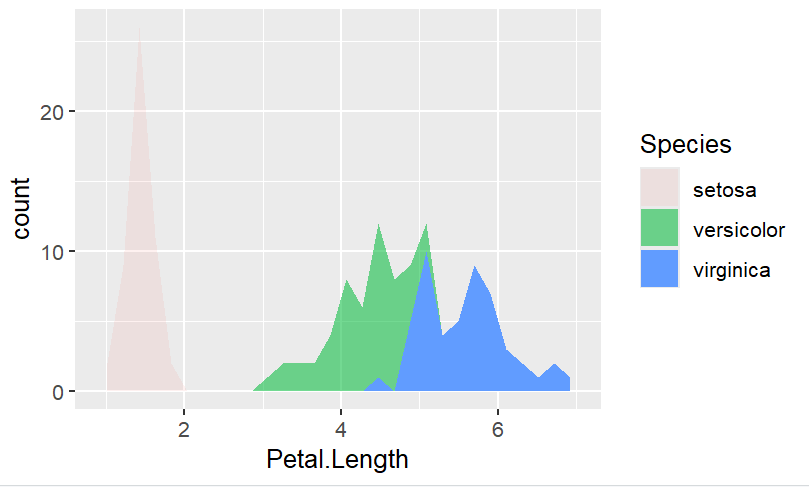

```{r opts, echo = FALSE,warning=FALSE, message=FALSE}
knitr::opts_chunk$set(message=FALSE, warning=FALSE, fig.path = "img/")
library(tidyverse)

```

VU Amsterdam

# Introduction

This week:

1. We will refresh your memory regarding R and RStudio.
2. We will give you a refresher on working with the **R programming language**.
3. We will get you started working with text analysis in R. 

For the second point, we will work with `tidyverse` For the third, we will give you a glimpse **under-the-hood** of common text analysis techniques using `stringr`.

In the previous practical about **validity** you saw that it cannot be taken for granted that an automated analysis accurately measures what we actually want to measure.

In this and the coming lectures, we will deepen this understanding by looking closer at how computers actually perform these measurements.
This will help you develop a better intuition for what we can and cannot do with automated analyses of texts.

You will also get first-hand experience with the practice of *data science*, which is a [growing specialization among social scientists](https://campus.sagepub.com/blog/data-science-survey) in both academia and business.
This will help you determine *whether* this is a direction that you'd like to pursue.
And even if you come to the conclusion that programming is definitely not your cup of tea, it's still valuable to have walked some miles in the shoes of a programmer.
This course thereby follows the recommendation of [Van Atteveldt & Peng (2018)](https://www.tandfonline.com/doi/full/10.1080/19312458.2018.1458084) to at least "stimulate and facilitate" the learning of computational skills:

> Not everyone can (or should) become a programmer, but modern computer languages, libraries, and toolkits have made it easier than ever to achieve useful results, and with a relatively limited investment in computing skills one can quickly become more productive at data driven research and better at communicating with programmers or computer scientists.
> We think it is vital that we make computational methods more prominent in our teaching to make sure the new generation of communication scientists and practitioners are stimulated and facilitated to learn computational skills such as data analytics, text processing, or web scraping, as applicable.
> (p. 87-88)

# 1. R-markdown: How to work with the R tutorial documents

As you probably noticed, the format of this tutorial is somewhat different from previous weeks. Before the tutorials were PDF files, but now it's this HTML document. Long story short, these tutorial documents are themselves generated in R (using [R-Markdown](https://rmarkdown.rstudio.com/)).
This guarantees that any code shown here does actually work.
So, as long as you copy/paste all the code from this tutorial, and execute it in the same order as we showed it in the tutorial, everything *should* work.

We say *should*, because you will most likely run into *some* errors.
Even if the code itself is correct, things can still go wrong due to different (versions of) software and if the code is not executed in the right order.
Think of it as a recipe: you can still mess it up if you use the wrong equipment or ingredients, or if you perform steps in the wrong order.

# 2. What is R?

As you may remember from previous courses, R is an open-source statistical software language R is in particular popular among computational social scientists. R is not the same as RStudio. R is the programming language, while RStudio is a software to interact with R in an easier way.

R increasingly replaces more traditional proprietary statistics software such as SPSS and Stata. This has several main reasons:

-   R is a programming language, which makes it more versatile. While R focuses on statistical analysis at heart, it facilitates a wide-range of features, ranging from [text analysis](https://www.tidytextmining.com/) to advanced [visualizations](https://www.r-graph-gallery.com/).
-   The range of things you can do with R is constantly being updated. R is open-source, meaning that anyone can contribute to its development. In particular, people can develop new *packages*, that can easily and safely be installed from within R with a single command. Since many scholars and industry professionals use R, it is constantly kept up-to-date.
-   R is free. While for students this is not yet a big deal due to university discounts for various statistics software, this can be a big plus in the commercial sector. Especially for small businesses and free-lancers.

## 2.1 Getting started with R and RStudio

> If you already installed and played around with R and RStudio before, you can skip this part and go straight to section 2.2.

To get started with R, you will need to install two (free) pieces of software.

-   *R* is the actual R software that is used to run R code. Technically, this is all you need, but by itself R is not very nice to work with. Rather than using R by itself, it's therefore common to also install a `graphical user interface` (GUI).
-   *RStudio* is the most popular GUI for R. It makes working with R a lot easier and more pleasant.

You won't need to run these two pieces of software side-by-side.
When you open RStudio, it will automatically also open R.
Both programs can be downloaded for free, and are available for all main operating systems (Windows, macOS and Linux).

### Installing R

To install R, you can download it from the [CRAN (comprehensive R Archive Network) website](https://cran.r-project.org/).
**Do not be alarmed** by the website's 90's aesthetics.
R itself is cold, dry, no-nonsense software, and the website kind of reflects that.
When you're working with R, you'll actually be using RStudio (as we'll install next), which makes everything much prettier and nicer.
In previous years we also noticed that some students worry about how safe the website is, since it looks so...old.
But yes, this is the official R website, and it can definitely be trusted.

If you have trouble with the download instructions, you can use [this link](https://www.datacamp.com/community/tutorials/installing-R-windows-mac-ubuntu) for additional instructions with pictures.

### Installing RStudio

The [RStudio website](https://www.rstudio.com/) contains download links and installing instructions.
You will need to install the free *RStudio Desktop Open Source License*.
This website is decidedly more user friendly, but if you have trouble figuring out which links to click, [this guide](https://www.datacamp.com/community/tutorials/installing-R-windows-mac-ubuntu) again can help.

Note that while you can also get paid licenses for RStudio, these are not required for *using* RStudio.
R and RStudio are free to use for both academic and [commercial purposes]((https://opensource.org/faq#osd)).

## 2.2 What if I have problems with R?

Although R works on all operating systems (Windows, macOS, Linux), there are rare cases where it can be difficult to install R, or to install certain packages. It can also happen that your computer doesn't have enough resources to run certain exercises. 

Whenever you run into any of those problems, please notify your teacher, and we'll try to make it work.

Although R works on almost every system, in the unlikely case that we can't get R to work on your computer, you don't have to worry. You can use the Social Media Analytics [JupyterHub](https://hub.compute.vu.nl/) environment. To learn how upload and download files, you can follow this [tutorial](https://societal-analytics.nl/blogs/20250201_computing-power/).

This JupyterHub can also be used if your computer has a RAM smaller than 16GB.
This setup includes the lasts versions of R and RStudio.

The data you will use during Q5 is stored in: `/srv/scistor/data/SMA/data`

To access the Q5 data, you can follow the steps in the image beneath:


<!-- [run R from the cloud](https://rstudio.cloud/plans/free), which is free for up to 25-hours per month. -->

<!-- This should mainly be used for practice, as we recommend doing the assignments on a personal (teammate's) computer. -->

<!-- If there are many people in the team who can't get R to work, you can contact the course coordinator (Kasper Welbers) for an alternative solution. -->

# 3. Basics of working with `tidyverse`

[Tidyverse](https://tidyverse.org/) is a package of packages, where all the packages share an underlying design philosophy, grammar, and data structures. In this tutorial, we will focus on three of them `dplyr`, `ggplot2`, and `stringr`.

**Exercise 3.a:** In your R-script install and load the package `tidyverse`. Hint: Use the functions `install.package()` and `library()`. Remember that you search for the function in the help panel, if you need more information on how to use it. 


## Tibbles

According to the `tidyverse` developers:
> A [tibble](https://tibble.tidyverse.org/), or tbl_df , is a modern re-imagining of the data frame, keeping what time has proven to be effective, and throwing out what is not. Tibbles are data.

So, we will use `tibbles` as a way to interact with a `data.frame()`. For this section of the practical, we will work with the data frame *iris*. The data frame *iris* belongs to the Base R package, you just need to call it to start using it. However, we will save it in a different variable as a `tibble`:

```{r Loading iris}

IRIS<-tibble(iris)

```

To check what is in the data frame *IRIS*, we can now just call it:

```{r Checking iris}

IRIS

```

As you can see in the console, `tibble` reports back the most important elements of your data frame. 

**Exercise 3.b:** Answer the following questions by checking the elements of your tibble:

1. How many rows and columns does your data frame have?
2. What are the names of your columns?
3. What type of data is stored in each column (e.g. double, character, factor)?

Remember that R is case sensitive, so if you need to double check the names of the variables/ columns, you can use the function `names()`:

```{r Checking the variables}

names(IRIS)

```

## Pipe `%>%` or `|>`

An important function from  `tidyverse` is the pipe `%>%`, also called `|>`. This function takes the output from the previous function and uses it as input for the next one. Let's show an example of its usage:

```{r Pipe}

IRIS%>%
  names()

```

In the previous code, we are simply passing the tibble IRIS as the main parameter to the function `names()`.

From here onward, we will continue using the pipe to pass outputs to the functions.

# 4 Data handling with `dplyr`

[Dplyr](https://dplyr.tidyverse.org/) is a powerful, fast, and user-friendly R package designed for data manipulation and wrangling, often described as a "grammar of data manipulation". 

Dplyr provides a consistent set of "verbs" (functions) to solve common data challenges. You can check all of them in their webpage, but you can also check its [Cheat Sheet](https://rstudio.github.io/cheatsheets/data-transformation.pdf). 

For this practical, we will focus on `Dplyr`'s main functions:
* `filter()`: Keep or drop *rows* that match a condition.
* `select()`: Keep or drop *columns* using their names and types.
* `arrange()`: Order rows using column values.
* `mutate()`: Create, modify, and delete columns.
* `summarise()`: Summarise each group down to one row.
* `group_by()`: Take an existing data frame and converts it into a grouped data frame where operations are performed "by group".


## 4.1 Using `filter()`

This function is used to subset a data frame, applying the expressions in "..." to determine which rows should be kept.

In its core, this function creates a logical vector. So, if you want to keep the opposite, then you can use the operator “!”.

Let’s say that you want to keep only the elements in the column `Species` that are equal to “setosa”:

```{r Filter example}

filter(IRIS,Species=="setosa")

## This is equivalent to:

IRIS%>%
  filter(Species=="setosa")

```

To write logical expressions, you can use the special functions:

* `==`: Is the element on the left equal to the element on the right?
* `>=`: Is the element on the left bigger or equal than the element on the right?
* `<=`: Is the element on the left smaller or equal than the element on the right?
* `!=`: Is the element on the left different than the element on the right?
* `>`: Is the element on the left bigger than the element on the right?
* `<`: Is the element on the left smaller than the element on the right?

**Exercise 4.1:** From the IRIS data frame keep only those rows where `Petal.Width` is smaller or equal than its mean. For this, pass IRIS to `filter()` using the pipe `%>%`. Hint: Use `mean(Petal.Width)` to get the mean of `Petal.Width`. 


## 4.2 Using `arrange()`

This function orders the rows of a data frame by the values of selected columns.

As an example, we will order the data frame by the `Petal.Width` values. At the end, we pass the resulting data frame to the function `View()` so that you can see the changes.

First, we do so in ascending order. This is how the code would look, if we do NOT use the pipe function:

```{r arrange ascending}

View(arrange(IRIS, Petal.Width))

```

If we use the pipe then the code would be:

```{r arrange ascending W pipe}

IRIS%>% 
  # 1. We pass the IRIS data to the function arrange
  arrange(Petal.Width)%>% 
  # 2. We pass the result from using arrange to the function View
  View()

```

As you see, using the pipe allows for an easier reading of the code. 

Second, we do so in descending order:
```{r arrange descending}

IRIS%>%
  arrange(desc(Petal.Width))%>%
  View()

```

**Exercise 4.2:** Arrange the IRIS data frame in descending order by `Petal.Length`.


## 4.3 Using `mutate()`

`mutate()` creates new columns that are functions of existing variables. It can also modify (if the name is the same as an existing column) and delete columns (by setting their value to NULL).

As example, let’s say that you want to add 2 to the column `Sepal.Width`:

```{r mutate}

IRIS%>%
  mutate(Sepal.Width2= Sepal.Width+2)%>%
  View()

```

In the example, `mutate()` does the following:

1. Creates the new column with the name `Sepal.Width2`.
2. Then it stores in each element the result of performing the operation.

**Exercise 4.3:** Create a new column called `MEAN_Petal.Length` where you store the mean of the variable `Petal.Length`. Hint: Apply the function `mean()` to the variable `Petal.Length`.


## 4.4 Using `summarise()`

`summarise()` or `summarize()`: creates a new data frame. It returns one row for each combination of grouping variables; if there are no grouping variables, the output will have a single row summarizing all observations in the input. It will contain one column for each grouping variable and one column for each of the summary statistics that you have specified.

As example, let’s say that you want to get the minimum of the columns `Sepal.Length` and `Sepal.Width`:

```{r summarise}

IRIS%>%
  summarise(min(Sepal.Length),min(Sepal.Width))

```

As you can see in the result, `summarise()` returned one single row with the minimum of each column/ variable. This is different from using `mutate()`, where you would have gotten a new column/ variable where the minimum repeats in each element:

```{r summarise vs mutate}

IRIS%>%
  mutate(min(Sepal.Length),min(Sepal.Width))%>%
  View()

```

**Exercise 4.4:** Obtain the maximum of all the numerical columns. Hint: Use the function `max()`.


## 4.5 Using`group_by()`

Most data operations are done on groups defined by variables. `group_by()` takes an existing tibble and converts it into a grouped tibble where operations are performed "by group".

As example, let’s say that you want to get the minimum of the columns `Sepal.Length` and `Sepal.Width` by Species:

```{r summarise by group}

IRIS%>%
  # 1. We tell R that the following transformations should be done by group:
  group_by(Species)%>%
  # 2. We perform the transformations:
  summarise(min(Sepal.Length),min(Sepal.Width))

```

As you can see, now you got one row per `Specie`'s category ("setosa", "versicolor", and "virginica"). Each row represents the minimum value of `Sepal.Length` and `Sepal.Width` per category, i.e. per group.

**Exercise 4.5:** Obtain the maximum of all the numerical columns per `Specie`'s category.


# 5.Data visualization with `ggplot2`

`ggplot2` is a package for creating graphs, which follows the grammar of graphs.

**What is the grammar of graphs?** The grammar of graphs tells us that:
> "... Every statistical graph is a mapping of data to a set of geometric objects (points, lines, bars) that contain aesthetic attributes (color, shape, size). The graph can even have statistical transformations of the data, and these are drawn on a specific Cartesian plane." [link](https://doi.org/10.1007/978-3-319-24277-4)

Based on the grammar of graphs, some of the basic components of a graph are:

1. The Data
2. The mapping
3. The layers
4. The scales
5. The theme


Let's us briefly explore each element.

## 5.1 The data

The data is the foundation of every graphic. The system works best if the data is provided in a tidy format, which briefly means a rectangular data frame structure where rows are observations and columns are variables.

To start a graph using `ggplot2`, you simply need to pass it to the function `ggplot()`:

```{r start the graph}

IRIS%>%
  ggplot()

```

As you can see in the "Plots" panel, `ggplot2` displays an empty canvas. 

## 5.2 The mapping

The mapping of a plot is a set of instructions on how parts of the data are mapped onto aesthetic attributes of geometric objects. It is the ‘dictionary’ to translate tidy data to the graphics system.

This simply translated into passing which variables you would like to represent in the graph. This is done by using the function `aes()`. This function must be nested inside the function `ggplot()`. 

Let's use it to tell `ggplot2` that we want to graph the variable `Sepal.Length` as a function of the variable `Petal.Length`:

```{r pass the variables}

IRIS%>%
  ggplot(aes(x=Petal.Length, y=Sepal.Length))

```

Now, in the "Plots" panel, you can see that in the 'x-axis' and the 'y-axis', `ggplot2` is representing the variables `Petal.Length` and `Sepal.Length` respectively.

## 5.3 The layers

The layers are made of geometric objects (which we'll call geoms) and statistical transformations (which we'll call stats). Geoms represent what you see on the graph: points, lines, polygons, etc. Stats are a summary of the data being observed. You can find a full list of possible objects in the `ggplot2` [Cheat Sheet](https://posit.co/wp-content/uploads/2022/10/data-visualization-1.pdf).

Let's represent the relation between `Petal.Length` and `Sepal.Length` with points. For this, we must pass the function using the special function **`+`** instead of `%>%`. Then we can use the function `geom_point()`:

```{r add the layers}

IRIS%>%
  ggplot(aes(x=Petal.Length, y=Sepal.Length))+
  geom_point()

```

## 5.4 The scales

The scales map the values of the data to values in an aesthetic space, such as color, size, or shape. Scales draws the legends or axes, which provides reverse mapping that makes it possible to read the original data from the graph.

Let's say that you want to color your graph by the `Species` categories. Then, inside the `aes()` function you can pass the "color" scale/parameter:

```{r add the scales}

IRIS%>%
  ggplot(aes(x=Petal.Length, y=Sepal.Length, color=Species))+
  geom_point()

```

The types of scales that you can use depend on the geometry. You can check them either in the [Cheat Sheet](https://posit.co/wp-content/uploads/2022/10/data-visualization-1.pdf) or under the "Aesthetics" section of the "Help" panel. 


## 5.5 The theme

Themes allows you to exercise fine control over the non-data elements of your plot. The theme system does not affect how the data is rendered by geoms, or how it is transformed by scales. Themes don’t change the perceptual properties of the plot, but they do help you make the plot aesthetically pleasing or match an existing style guide. Themes give you control over things like fonts, ticks, panel strips, and backgrounds.

`ggplot2` offers some predefined themes, such as `theme_bw()` and `theme_light()`. So, we will apply one of them to our graph to make it look better. Remember that in `ggplot2` you add components using the special function `+`:

```{r add the theme}

IRIS%>%
  ggplot(aes(x=Petal.Length, y=Sepal.Length, color=Species))+
  geom_point()+
  theme_light()

```


## **Exercise 5**

Now it is your turn to create a `ggplot2` graph. As mentioned before, in the `ggplot2` "Cheat Sheet", you can check the different geometries together with what scales can be changed depending on the plot.

Using the information in the box “ONE VARIABLE continues”, write the code to produce the following graph:




# 6.Text handling with `stringr`

For this section of the tutorial, we will use the `tidyverse` package `stringr` to handle text. 

`stringr` is a consistent, simple and easy collection of character string/text/natural language processing tools for pattern searching, random string generation, case mapping, string transliteration, concatenation, sorting, padding, wrapping, and more!

`stringr` offers plenty of functions to work with text ([Cheat Sheet](https://rstudio.github.io/cheatsheets/strings.pdf)) However, we will now only cover the necessary to clean and homogenize the data that we will analyse:

1. `str_remove_all()`
2. `str_replace_all()`
3. `str_to_lower()`
4. `str_squish()`
5. `str_detect()`

In this part of the tutorial, we will use the `sentiment_tweets.csv` dataset. You can find this dataset both in CANVAS and the course JupyterHub environment.

In your R-script save the path to the folder where you stored the data and then open the data in R:

```{r Opening the data}

# DIR="PATH TO FOLDER"

TWEETS<-read.csv(paste0(DIR,"sentiment_tweets.csv"), skipNul = TRUE)

```


**Exercise 6:** In your R-script, transform and save your data as a `tibble`. Based on the `tibble`'s information answer the following questions:

1. How many rows and columns does the tibble have?
2. What type of data type are your variables?


## 1. The function `str_remove_all()`

Let's first remove the quotes from the text, as they can cause issues when analyzing the tweets. This is mostly because some of the tweets have uneven number of quotes \". To solve this issue, we will use the `tidytext` function `str_remove_all()` to remove all '\"' characters in the text:

```{r str_remove_all}

text<-'\" Uneven quotes '

cat(text)

text<-str_remove_all(text,'\"')

cat(text)


```

**Exercise 6.1:** Apply the function `str_remove_all()` to the column `text` of the tibble. Remember that in order to save the result, you need to save the modified tibble in itself, i.e. in the variable TWEETS. Hint: Use the `dplyr` function `mutate()` to save the modified column "text" in itself. Remember that `mutate()` would apply the function `str_remove_all()` to each element of the column `text` and save them in a new column.  


## 2. The function `str_replace_all()`

Now, we are going to replace any '\n' (escape character) with an space " ". A escape character creates a new line when used in the text. For that, we will use the function `str_replace_all()`.

```{r remove str_replace_all}

text<-'Escape\n character.\n'

cat(text)

text<-str_replace_all(text,'\n',' ')

cat(text)

```

**Exercise 6.2:** Apply the function `str_replace_all()` to the column `text` of the tibble. Remember that in order to save the result, you need to save the modified tibble in itself, i.e. in the variable TWEETS. Hint: Use the `dplyr` function `mutate` to save the modified column "text" in itself. Remember that `mutate()` would apply the function `str_replace_all()` to each element of the column `text`.  


## 3. The function `str_to_lower()`

The next step is to homogenize the text by turning it into lower case. For this, we use the function `str_to_lower()`:

```{r str_to_lower}

text<-'ThIs Is A WeIRD Sentence.'

cat(text)

text<-str_to_lower(text)

cat(text)

```

**Exercise 6.3:** Apply the function `str_to_lower()` to the column `text` of the tibble. Remember that in order to save the result, you need to save the modified tibble in itself, i.e. in the variable TWEETS. Hint: Use the `dplyr` function `mutate` to save the modified column "text" in itself. Remember that `mutate()` would apply the function `str_to_lower()` to each element of the column `text`.  


## 4. The function `str_squish()`

This is the final function that we will use to clean the text: `str_squish()`. `str_squish()` trims white space from each end and collapses multiple spaces into single spaces.


```{r str_squish}

text<-'  There   are too   many spaces in this    sentence.  '

cat(text)

text<-str_squish(text)

cat(text)

```

**Exercise 6.4:** Apply the function `str_squish()` to the column `text` of the tibble. Remember that in order to save the result, you need to save the modified tibble in itself, i.e. in the variable TWEETS. Hint: Use the `dplyr` function `mutate` to save the modified column "text" in itself. Remember that `mutate()` would apply the function `str_squish()` to each element of the column `text`.  


## 5. The function `str_detect()`

This function returns a logic value (`TRUE` or `FALSE`) depending on whether the text contains or not the pattern specified.

```{r str_detect}

text<-'in this text, i write about justin bieber.'

cat(text)

text<-str_detect(text, "bieber")

cat(text)

```

We can use the function `str_detect()` together with `filter()` to keep only those tweets that mentioned specific words:

```{r bieber tweets}

BIEBER<-TWEETS%>%
  filter(str_detect(text, "bieber"))

```

Now, we can plot the number of tweets that were positive, neutral, or negative:

```{r bieber tweets plot}

BIEBER%>%
  ggplot(aes(label,fill=label))+
  geom_bar()

```


**Exercise 6.5.a:** Create a barplot showing the number of times the word "trump" was mentioned by label.


**Exercise 6.5.b:** Interpret the results from Exercise 6.5.a.

