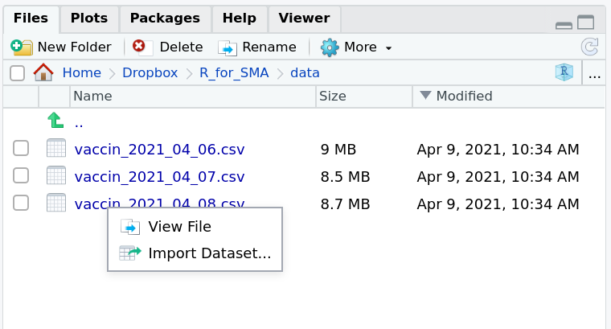
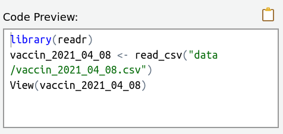
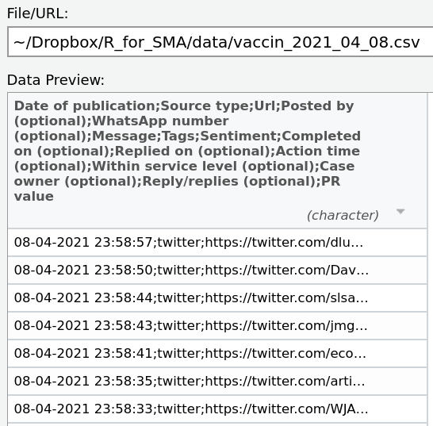
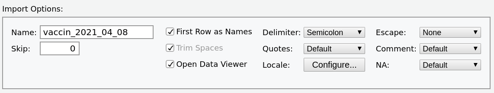
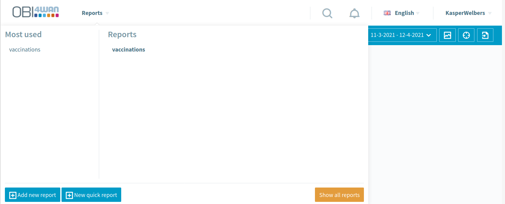
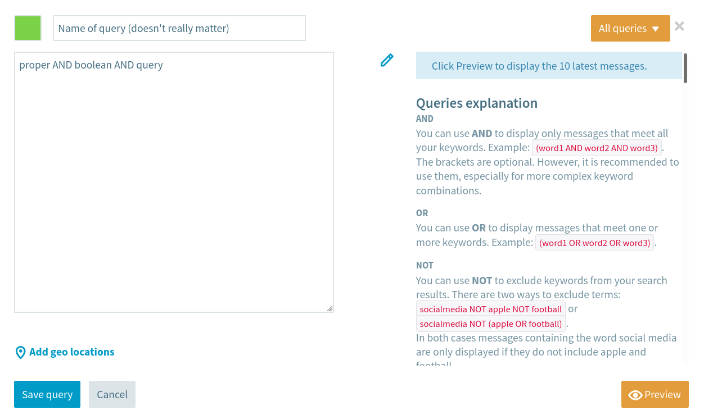
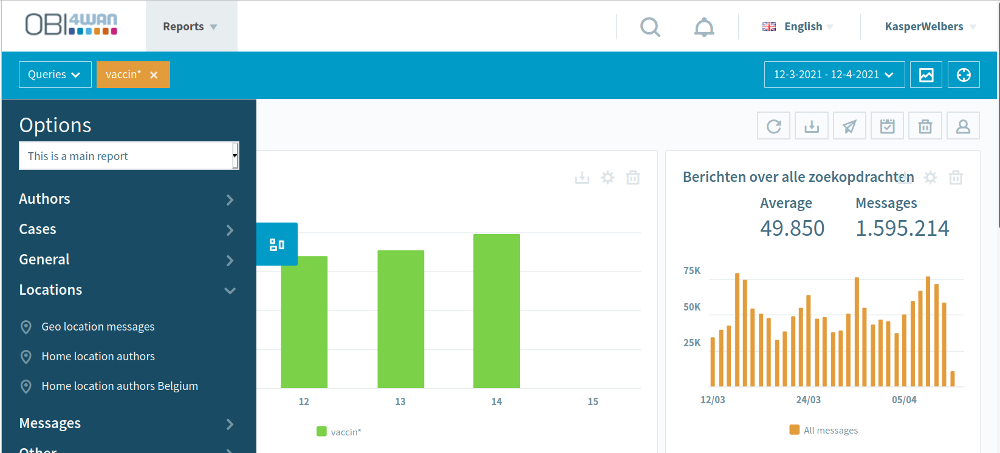

```{r opts, echo = FALSE}
knitr::opts_chunk$set(message=FALSE, warning=FALSE)
```

VU Amsterdam

# This practical

In the previous practical you already played around with word clouds and the keyness analysis.
In this practical we're going to have a closer look at these techniques, introduce a more advanced technique called topic modeling, and you will learn how to import OBI4wan data into R so that you can use these techniques with social media data.

## Important update to the quanteda package

In the previous practical you all worked with the quanteda package.
But it just so happens that a major update was just released.
Normally this would not be worthy of notice, because updates of R package tend to mainly just add new functionalities.
But this is a rare update that actually requires us to use the package a bit differently.
We therefore strongly recommend everyone to update quanteda.
Although you can still use the 'older' version, this might give you trouble later on when you accidentally update, or when you install quanteda on a different computer.

It's a bit inconvenient that this rare scenario happened in the middle of this course, and when you are just getting acquinted with R, but luckily the solution is really easy.
To update a package, we simply run the `install.packages()` command again.

```{r, eval=F}
install.packages('quanteda')
```

Now, one of the main changes of the new version is that some functions have been moved to new packages (kind of like add-ons). 
This also includes the `textplot_wordcloud` and `textstat_keyness` functions.
So in addition we'll need to install `quanteda.textstats` and `quanteda.textplots`

```{r, eval=F}
install.packages('quanteda.textstats')
install.packages('quanteda.textplots')
```

And now, whenever you want to use the textstats or textplots functionalities of quanteda, you
load both the main package and these sub-packages.

```{r}
library(quanteda)             ## gives you functions such as corpus(), dfm()
library(quanteda.textstats)   ## gives you functions such as textstat_keyness()
library(quanteda.textplots)   ## gives you functions such as textplot_wordcloud()
```

You might wonder why they made this change. 
The reason is probably just that quanteda is growing.
So rather than forcing you to install and load everything in one single package, they started moving parts of the code to different packages. 


# Importing texts into R

This time, we're going to be working with some actual social media texts, exported from OBI4wan.
For the first part of this practical, please use the files that we provided on Canvas (see page for this assignment).
Later on, we'll show you how to export your own data.

We're actually going to spend quite some time on this seemingly simple issue.
First of all, because this is useful knowledge.
Data obtained in the real-world can have many different formats, and you need to know a bit about the most common data formats to be able to use the data that you find.
Secondly, because it turns out that the data provided by OBI4wan is one of those cases where you'll need a little of this knowledge to import the data properly.
Don't worry, the solution is simple (one line of code), but behind this line of code lies a short story about `csv` files and the difference between America and Europe.


## Importing a single csv files

The files that we're going to import are `csv` files.
`csv` stands for Comma Separated Values, and it's is one of the most common formats for storing data in a `data frame` format. 
That is, data in which we have rows and columns.
You are probably most familiar with this type of data representation from Excel or SPSS. 
In the most typical use case, rows represent cases in your data (e.g., survey participants) and columns represent variables (e.g., age, gender).
In our current case, each row in our data is a tweet, and columns contain information about this tweet, such as the author and the text.

So why do we use `csv` files instead of something like Excel? 
The main reason is that a `csv` file is plain and simple.
Excel files have all sorts of bells and whistles, but that also means that we need complex (and sometimes paid) software to read these files.
Many software can import cvs files, but cannot import Excel files, so it's common to provide this type of data in a csv file.
In fact, you'll see later on that when you export data from OBI4wan, you can select `Excel` as the output type, but it actually gives you a `csv` file!

We're now going to look at how to import csv files into R. 
This is not hard, but it does require some thinking, so we'll walk you through this slowly.
One word of caution before we proceed.
It might be tempting to first open these files in Excel to see what they look like, but if you do this, MAKE SURE NOT TO SAVE THE FILE. 
As you'll see in a minute, there are also different types of csv files (yes, life is complicated). Software such as Excel often just tries the most common type, but this can (and in this case will) mess up your data.

For reading csv files into R, we're going to use the `read_csv` function from the `readr` package.
R also has a built-in function called `read.csv` (with a dot instead of an underscore), but the `read_csv` function from the `readr` package is faster and overall nicer. 
We'll first need to install `readr` (you only need to do this once)

```{r, eval=F}
install.packages('readr')
```

And now we can use `library` to use the package in our current session.

```{r}
library(readr)
```

To start, we're going to import the file `vaccin_2021_04_08.csv`.
To do so, we first need to know the location of this file on your computer (where you downloaded it to).
The tricky thing is that you need to provide this location as a `path` (e.g., `folder/subfolder/file.csv`), and many of you probably have little experience with this.
No worries, RStudio has your back. 
If you go to the bottom-right window in RStudio, and go to the `Files` tab, them you can navigate to the file. 
When you get to the file, you can click on it, and RStudio will give you the option to "View file" or "Import Dataset".

```{r, echo=F, fig.align='center'}

```

If you click "Import Dataset", then you'll get a window for importing the data.
Importantly, you SHOULD NOT press the 'import' button. 
This will directly import the data, but we insted want to copy the code for doing this, so that we can include it in our script. 
This code is provided in the bottom-right corner, in the 'code preview'

```{r, echo=F, fig.align='center'}

```

Here you see three lines of code.
The first one opens the package, but we already did that above.
The second one reads the data into R. That's the one we need, so copy it.
(your code will look different from mine, because this is the location on my computer)

```{r}
vaccin_2021_04_08 = read_csv("data/vaccin_2021_04_08.csv")
```

Oh no!! You probably got some red text about warnings and parsing failures and stuff. 
Something went wrong, and as you might have suspected, this is because the csv format
used by OBI4wan is not the most common csv format that is used here by default.

To see what goes wrong, open the "Import Dataset" window again.
Now look at the `data preview`.

```{r, echo=F, fig.align='center'}

```

The data preview shows us how the csv file is imported as a data frame.
But at present, it seems to put everything in a single column!
In the top-row, for instance, we see `Date of publication;Source type;Url;... etc.`. 
R doesn't recognize that `Date of publication` and `Source type` etc. are different columns!

Why does this happen?
Without going too much in-depth, it helps to understand that a `csv` file is really just a plain text file.
To separate the data in this file into columns, we need to specify a `delimiter`: something that tells R at what point the next column begins.
Very commonly this is a `comma`, hence the name `comma-separated values`.
However, sometimes a `semicolon` (;) is used instead, and that is what we see here.

The fix is easy. 
At the bottom we can specify some settings. 
Here we can set the delimiter to semicolon.

```{r, echo=F, fig.align='center'}

```

Once we do this, we should see the previous jumping into shape. 
In the code preview, you now see a new code that used the more flexible `read_delim` (read delimited) function, where we use our new custom setting.

So, now you know a bit about what a csv file is, and have the tools to import any kind of csv file!
But let's wrap-up with another simple trick.
The semicolon format used by OBI4wan is actually also pretty common, and is often referred to as the European standard (the `comma` version is more American).
And for this second common standard, there is also the `read_csv2` function.

```{r}
vaccin_2021_04_08 = read_csv2("data/vaccin_2021_04_08.csv")
```

So there's our one line of code solution!
To summarize, we use `read_csv` to import a csv file, but this assumes that the more *American* format is used.
OBI4wan uses the more *European* format, so we need to use `read_csv2`. If another format is used, you can manually specify settings with the `Import Dataset` feature. 


## Importing multiple csv files

We can now import a single csv file, but we actually have three files.
So let's import all three and then combine them into a single data frame.
For this add another tool to our belt: the `dplyr` package.
This is a very powerful package for working with data frames. 
Don't worry though, for now we just need a single function.

```{r, eval=F}
install.packages('dplyr')
```

A way to do this that's easy to understand is to just read each file, and then bind them together with the `bind_rows()` function (from the dplyr package).
We also load `readr` again here. 
That's not necessary, but it can't hurt either, and it makes it easier for you to copy/paste this code later on without forgetting about `readr`.

```{r}
library(dplyr)
library(readr)   

d = bind_rows(
  read_csv2("data/vaccin_2021_04_06.csv"),
  read_csv2("data/vaccin_2021_04_07.csv"),
  read_csv2("data/vaccin_2021_04_08.csv"))
```

Now we have a single data frame with 60.000 rows, where each row is a tweet.
The file is about 31 Mb in memory, which modern computers should be able to handle easily, but if you're having issues you might want to make sure that you don't have heavy software running (such as webbrowsers with many open tabs). 


### Optional: a more elegant solution

Our previous solution for reading and combining multiple files works, but we're lucky that it's just three documents.
In some cases we might want to read 100 files, so then we would ideally use a different solution.
Here we provide an example of what that might look like. 
It's not important to know this for this course, but it is a good example of the *DRY* (don't repeat yourself) principle in writing good code.

Here we first get a list with all the names of the files in our 'data' folder (on my computer I called this folder 'data', but you might have named it differently, and the folder might be in a different location).
With `pattern = 'vaccin'` we filter out all the file names that do not contain the text 'vaccin'. 
In the second step we use `lapply` (list apply) to apply the read_csv2 function to every file, and create a list of the output, and we immediately bind the data from this list into our data frame.

```{r, eval=F}
files = list.files('data', pattern = 'vaccin', full.names = T)
d = bind_rows(lapply(files, read_csv2))
```


# Assignment 1

In this assignment we'll first re-cap the techniques that you worked with before, but with this larger dataset (so yes, you'll need to run the code above to import the data for this assignment)
We'll help you get started by making the DTM, because the 'recommended' approach changed a bit
with the new update to quanteda.
The code that we used last time still works, but you would get a message saying
that some functions are 'deprecated' (meaning that they are outdated)

```{r, cache=TRUE}
library(quanteda)             
library(quanteda.textstats)   
library(quanteda.textplots)

corp = corpus(d, text_field = 'Message')    
dtm = dfm(tokens(corp, remove_punct=T))     
dtm = dfm_remove(dtm, stopwords('en'))
```

This time we're also stemming the data, as discussed in the video lecture.
This isn't necessarily better, but rather has certain advantages and disadvantages.
One thing you'll notice is that words will look weird, because stemming will
sometimes cut-off the suffix (last part of the word).
We use it here to show you how to use it, and to let you see for yourself how it
affects your analyses. Later in this practical you will have to decide whether you
will apply stemming on your own data.

```{r}
dtm = dfm_wordstem(dtm)
```

> **Question 1.a**. Create a wordcloud of this data with the `textplot_wordcloud` function, as you dit last week. Use arguments (e.g., max_words, color) to make it a nice wordcloud. Paste the wordcloud in your answer document, and provide a brief interpretation of what the wordcloud tells you about the data.

Next you'll do a keyness analysis with the `textstat_keyness` and `textplot_keyness` functions. Remember that last time you compared speeches by one president to other presidents. To do so, you had to use the `docvars` (document variables). Specifically, you used something like `textstat_keyness(dtm, docvars(dtm, 'President') == 'Obama')`. So let's first see what document variables we have this time. 

```{r, eval=F}
View(docvars(dtm))
```

An interesting column that we can use is `Sentiment`. This is the result of OBI4wan's automatic sentiment analysis tool. So we can look which words occur relatively often or seldom in tweets that have been labeled as positive, negative or neutral. What does this tell us? Well, good question.

> **Question 1.b**. Perform a keyness analysis, where the target is tweets that OBI4wan classified as "negative". Report the visualization, and interpret what this tells us. (hint: do not just think about what this can tell us about negative tweets, but also about how it might help us understand and validate the OBI4wan sentiment analysis tool).

Instead of looking at all words, we can also focus on hashtags.
The following code creates a new DTM with only hashtags as columns.
Notice that the code is actually quite simple to understand. 
The `dfm_select()` function lets us select columns.
with the `pattern` argument we specify a pattern that should occur in these columns.
Here we say that we want anything that start with a hashtag, followed by anything (remember the * wildcard).

```{r}
hashtag_dtm = dfm_select(dtm, pattern = '#*')
```

> **Question 1.c**. Answer question 1.a again (wordcloud + interpretation), but this time using the hashtag dtm.

> **Question 1.d**. Answer question 1.b again (keyness of negative tweets + interpretation), but this time using the hashtag dtm. 


# Topic modeling

Wordclouds and keyness analysis can be an nice way to get some idea of the total and relative frequencies of words in a corpus, but it can be a bit narrow to just focus on the most frequent words, and you don't always have interesting groups to compare. 
So what else can we do?

One powerful technique that has seen a great rise in the previous decade is topic modeling.
This technique falls under the category of `unsupervised machine learning`. 
We won't discuss how this works here (it is addressed in last video lecture), but in short it implies that we will train a computer to perform a task.
In this case, the task is to classify words and documents into *topics*.
The weird part is the fact that this training is `unsupervised`. 
We will not tell the computer what topics are, it will figure this out by itself.

There is a lot to be said about the strengths and weaknesses of this method, and in this course we won't even be able to cover the tip of the iceberg.
Still, it's a good method to learn about because it gives you a better idea of what is possible beyond simple techniques such as word clouds. 
Moreover, you'll see that using these techniques is really not that difficult. 


> Disclaimer: this type of analysis actually performs best with a lot of data, and then requires quite a lot of computational power to perform. It's not uncommon for a topic model to run for days on powerful computers. However, we can't really do that in this assignment.
With our dataset and the setting that we'll use, it will only take a few minutes.
As you'll see, this can already show some pretty cool results, but you should keep in mind that this is really just for demonstration purposes. 
Normally you would let the computer work more, and the results would be better.

## Preparing the data

We'll use the DTM that we created above (so make sure that you still have it in your environment).
But we'll take a few additional steps to clean it up a bit.
You won't need to remember each of the following steps.
For now try to focus on what we're trying to achieve.

For topic modeling, we really need to reduce the number of unique terms. The more terms in our data (i.e. the more columns in the DTM) the more time it will take for the computer to finish training.
Since we'll only be using a selection of the terms in our data, we'll need to think about which terms are most useful for classifying texts into topics.
Here, we'll start by removing any mentions of specific users (@*), because we're now interested in what is said, not by or to whom.
We'll also remove words with only 2 characters of less (mainly to remove hard to understand abbreviations). This also removes "RT" (retweet)

```{r}
dtm_trimmed = dfm_select(dtm, pattern='@*', selection='remove', min_nchar = 3)
```

Next, we'll filter our data so that we only use the 2500 most frequent words. 
We also remove all terms that occur in more than 50% of all documents, because terms that occur in almost all articles (such as 'vaccin', our search term) are not very informative.

```{r}
dtm_trimmed = dfm_trim(dtm_trimmed, min_termfreq = 2500, termfreq_type = 'rank', 
                                    max_docfreq = 0.5, docfreq_type='prop')
```

So let's see what we have.

```{r}
dtm_trimmed
```

We now have a DTM with 2516 unique terms (not exactly 2500 because some have the same rank). 
This will do for our current application.
It might give better results if we include more words (especially if we would have more documents), but this also takes more time to computer, so for this example we keep it low.

## Training a topic model

We're going to use the `stm` package, which allows us to train a [structural topic model](https://raw.githubusercontent.com/bstewart/stm/master/vignettes/stmVignette.pdf).

```{r, eval=F}
install.packages('stm')
```
```{r}
library(stm)
```

While it might be hard to understand *how* this technique works, it's really easy to apply it. THe following code will train a stm given our data.
We also need to set the number of topics (K = 10) that we want to computer to look for.
In addition, we limit the maximum number of iterations (max.em.its) to 20.
Simply put, we tell the computer to stop training after 20 iterations (say, rounds of training) even if it isn't 'finished'. 
We will actually get better results by removing this limit, or setting it higher.
This will only require more time (but computer time is free), but for this example we keep it low.

```{r, echo=F}
set.seed(1)
```
```{r, results='hide', message=FALSE, warning=FALSE, cache=TRUE}
m = stm(dtm_trimmed, K=10, max.em.its = 20)
```

When this finishes you might get some harmless warnings mentioning `Dropped empty document(s)`.
This simply means that some of our texts were empty after the preprocessing steps, and these are ignored in the analysis.

While you wait for your computer to finish, let's talk about what type of output you'll get.
The 'topics' that the topic model will come up with, are most easily described as word clusters.
The computer won't come up with fancy labels, like: the topic is `The possible link between AstraZeneca vaccinations and blood clots`.
It will only tell us that there is a topic, and what the most important words in this topic are.
So if it finds a topic about the link between AstraZeneca and blood clots, it will only tell us something like: `there is a topic in which the words "astrazeneca", "blood" and "clot" are very prominent`.
It still requires a human to interpret that this combination of words refers to `The possible link between AstraZeneca vaccinations and blood clots`.

In our model, this topic indeed came up. 
We say "in our model", because it is not guaranteed that when you train the topic model with the same data, that the exact same results come out.
Depending on what specific technique for topic modeling is used, there can be a certain randomness to how the computer will search for patterns. 
The `stm` method we use here is rather consistent, so you should get very similar results as us, but it could for instance be that topics are presented in a different order.

To get a broad idea of what topics we found, we can plot the model.
Here the only argument we give is `n = 5`, which simply means that for every topic we want to see 5 important words.

```{r stm_plot}
plot(m, n=5)
```

The topics in this plot are ordered by how 'big' they are in our corpus. 
You can read this like a bar chart, where we see that Topic 1 had a topic proportion of about 0.25,
which means that about 25% of the words in our corpus were part of this topic.

The first step in working with a topic model is often to interpret what each topic is about,
and then give it a more usefull label.
For instance, we could label topic 6 as `the link between AstraZeneca and blot clots`. 
However, based on just the few words in our plot, it can be hard to interpret what a topic is really about.
Before we say that word clouds are a nice way to visualize which words are most important.
`stm` therefore also allows you to make word clouds of the most important words in a topic.
Let's use this to help us interpret topic 6.

```{r stm_cloud}
cloud(m, topic = 6, max.words = 25)
```

Alternatively, `stm` has a `labelTopics` function that gives us more information to determine how we might want to label our topics.
Next to looking at the most common words, this also gives other rankings of how important words are within a topic. 
For instance, we could look at words that are relatively more likely within a topic compared to all other topics (similar to the keyness analysis).

```{r, eval=F}
labelTopics(m)
```

We won't discuss the results here, because at this point you might be getting overwhelmed, and we think the main idea is clear. 

## Wrap-up: a first look at topic models

As we said, topic modeling is a big and rather complicated topic, so don't worry if you still have little clue about what is going on here.
The main takeaway is that you have seen a bit more about what we can do with a document term matrix.
Modern techniques for automatic text analysis go beyond just counting words and making wordclouds. 
Scholars and professionals are actively developing techniques such as topic modeling, that can be used to analyze communication on an unprecedented scale. 
These techniques are becoming more common in research in our field and in the professional sector, so it's important to have a general understanding of what these technique can (and can't!) do. 

Also, we hope that you see that it doesn't require great technical skills to use these techniques. 
It's off course important to learn more about topic modeling to properly use it in research, but you do not need to understand all the mathematics behind it. 
Similar to how statistical software such as SPSS has allowed many researchers to conduct advanced statistical analysis, programming languages such as R now allow researchers to use state-of-the-art text analysis techniques.


# Getting your own data from OBI4wan

Now you're going to use these techniques to conduct your own exploratory analysis.
You already saw how to import OBI4wan csv files into R, but not yet how to export data from OBI4wan to csv files.
This is rather easy, but OBI4wan has the feature somewhat hidden, so we'll walk you through the steps.

The main trick is that you can only download texts when you have created a `report`.
Up till now we just performed single queries one at a time, but one of the main ways of working with OBI4wan is that you create a report, in which you save one or multiple search queries.
Then you can customize how you see the results (e.g., timeline, sentiment, messages), and possibly add some text, so that you essentially have an interactive report that you can automatically update.
We're not actually going to use that functionality, but we will need to create a report in order to download messages.

## Creating an OBI4wan report

Once logged in to OBI4wan, click the *Reports* button at the top, and then select `Add new report`.

```{r, echo=F, fig.align='center'}

```

In the window that opens, you just have to provide a name for the report. 
Also, though not strictly required, go to the `Based on report` field and select `Template: Volume rapportage`.
This automatically creates a basic report style.
Skip setting a query for now, we'll do this in the next step (so you'll also now how to add new queries later on)

Once you've created your report, you'll need to add your query. 
On the top-left there is a `Queries` button, so click it and then click `new query`.
Now you can enter the name of the query and the actual query.
The name doesn't really matter, but the query itself needs to be good, as discussed in the first practical. 
Note that on the right you also get a summary of Boolean operators and other query options.

```{r, echo=F, fig.align='center'}

```

Once you've created your query (make sure that you clicked `Save query` in the previous step), your report will now show the results of this query.
Note that if you didn't use a template your report will initially be empty, and you'll have to add some analysis components yourself. 
You can do this via the menu to the left of the screen.
Here you can also add additional components, such as a Geo location map.

```{r, echo=F, fig.align='center'}

```

## Downloading messages from a report

On the top right of your report there is an `Export report` button (the button is just a download symbol, you see the name when you hover the mouse over it).
If you click it, you get the option to `Export messages to Excel`. 
That's the one you need.

```{r, echo=F, fig.align='center'}
knitr::include_graphics('img/OBI_export.png')
```

Although it says Excel, you will actually get the data in csv format.
You can now use the code from the start of this practical to import it.


```{r, eval=F}
library(readr)   
read_csv2("location_on_your_computer/name_of_your_OBI4wan_file.csv"),
```

## Getting more data from OBI4wan

The OBI4wan data export only gives you the first 20,000 messages of your query results.
This is simply to make it harder for you to download all the messages.
Providing this data is their core business, after all, so they won't easily give it all to you, and especially not if we're using a cheap educational license.

For this course we certainly don't need ALL data, so this limitation is fine.
However, there is a problem with the specific 20,000 messages that OBI4wan returns.
These are `NOT randomly selected`, but `the 20,000 MOST RECENT` messages.
This means that if we get 1,000,000 results in a period of several months, and we want to analyze a sample of this data in R, we can't just download the max 20,000 messages, because this will only give is just the 'last' 20,000 messages in this time period.

For longer periods of time, and for getting more than 20,000 messages, we can use a simple trick.
OBI4wan lets us filter the results on a specific time period. 
So if we have 100,000 message in one week, what we can do is adjust the time filter to query this data 7 times for each day of the week, and then download the results each time.
For example, here we select all articles from April 10 at 00:00 to April 10 at 23:59. 

```{r, echo=F, fig.align='center'}
knitr::include_graphics('img/OBI_timefilter.png')
```

Now we can download this selection, and then in the time filter we just need to adjust our selection
to April 9 and download. Then adjust to April 8 and download. etc.
This way you can still download all messages within a time period without too much effort.

Still, you don't want to do this for every day of the year, and OBI4wan would probably also not like this (though we're not breaking any rules).
Also, if a day has more than 20,000 messages you'll miss some (you could use smaller time windows, but this becomes tiresome fast).
Keep this in mind when you think of topics and make queries to use in this course.
It's often much easier to focus your analyses on research questions that require a short time frame (e.g., one week of messages about the elections) rather than a long time frame (e.g., one year of messages about Covid-19).


> You might wonder whether we can't just automate this, since this is a course about automating stuff. The answer is yes. Often these types of data platforms also provide an API, which allows you to directly connect to the platform from within R. Also, even if a platform doesn't provide an option to automate this, we could actually write an algorithm that acts like a human and performs the day-by-day download. But at this point, we're also entering a more complicated terrain involving copyright and terms-of-service. Platforms such as OBI4wan will often have restrictions for how many articles we can download, and this is actually an important consideration in choosing which platform to buy a licence for. More on this in the optional bonus section at the bottom.


# Assignment 3

Now you're going to combine all that we've discussed to conduct your own little exploratory analysis.
For this assignment you'll investigate how people on Twitter talked about a certain person, organization or topic.
Given the limitations for exporting data from OBI4wan, you'll have to focus on max. 1 week of messages.
This doesn't have to be a special week. 
You could for instance just ask: `"how did people talk about Mark Rutte in the past week?"`. 
Still, for your analysis it's easier (and more fun) to pick a person/organization/topic where something interesting happened within this week.

You will collect the data yourself from OBI4wan, using the trick described in `Getting more data from OBI4wan`.

* Make sure to filter sources so that you only look at Tweets. 
* If there are more than 20,000 messages on a day, you can just download these 20,000 messages and ignore the rest (so you won't have to query on shorter time periods).
* You should focus the analysis on a period of max 1 week, but you can also focus on a few days. 

> **Question 2.a**. Pick a person, organization or topic and create a query. Perform the query to look for all messages in the time period (max 1 week) of your question. Report what you will investigate, and provide the query and number of messages in your answer.

Now you're going to download the results per day from OBI4wan, import them into R, and perform a wordcloud and topic model analysis. 
We summarize the code here.
Remember that you can navigate to the file in the file window (bottom-right corner of RStudio) and click on the file to get the location, and that you need to use `read_csv2` instead of `read_csv` to import it correctly.

```{r, eval=F}
## load the packages
library(dplyr)
library(readr)   

## import the data into R
## (maybe you'll need more lines, if you have more files)
d = bind_rows(
  read_csv2("location_on_your_computer/file_from_obi4wan.csv"),
  read_csv2("location_on_your_computer/another_file_from_obi4wan.csv"),
  read_csv2("location_on_your_computer/yet_another_file_from_obi4wan.csv"))

## check whether it worked
d
```

Now you can see whether it worked. If successful, the output should show you the top rows of the data frame (here called a tibble, which is a special type of data frame). It also shows you how many rows and columns you have: `# A tibble: [rows] x [columns]`.

> **Question 2.b**. Make a screenshot of the output and paste it in your answer document. 


Now you can create the DTM and perform the analysis.
We again provide you with the code. 
However, you might have to change some parts yourself (`stopwords` are currently English, so set them to Dutch if you have Dutch data)
You can also choose whether or not you want to use *stemming* (`dfm_wordstem`), and **we will ask you about this choice in the assignment**.
Furthermore, you can get points for doing things better, such as adding colors to the wordcloud, and changing some settings for training the topic model (for which there are hints in the section on topic modeling).

```{r, eval=F}
## load the packages
library(quanteda)             
library(quanteda.textplots)
library(stm)

## creating the DTM
corp = corpus(d, text_field = 'Message')    
dtm = dfm(tokens(corp, remove_punct=T))

## some preprocessing
dtm = dfm_remove(dtm, stopwords('en'))
dtm = dfm_wordstem(dtm)

## making a wordcloud
textplot_wordcloud(dtm, max_words = 50)

## training a topic model
dtm_trimmed = dfm_select(dtm, pattern='@*', selection='remove', min_nchar = 3)
dtm_trimmed = dfm_trim(dtm_trimmed, min_termfreq = 2500, termfreq_type = 'rank', 
                                    max_docfreq = 0.5, docfreq_type='prop')
m = stm(dtm_trimmed, K=10, max.em.its = 20)

## analyzing the topic model
plot(m, n=5)
cloud(m, topic=1)
cloud(m, topic=2) # etc.
labelTopics(m)
```


> **Question 2.c**. There are advantages and disadvantages to `stemming` data (as discussed in the video lecture). You could now choose whether or not to use stemming (whether or not you used `dfm_wordstem`). What did you choose and why. (hint: both stemming and not stemming can be correct. The question is purely about your justification for the choice.)

> **Question 2.d**. Report and interpret the wordcloud. Does it give you a clear idea of what the tweets are about?

> **Question 2.e**. Report and interpret the topic model. Describe 2 topics with the clearest interpretation (based on the topic wordcloud and labelTopics function). Does it help you get a better idea of what the tweets are about? 

> **Question 2.f**. You work for a social media dashboard company, and they just implemented topic modeling as a new feature. Before, they just showed a single wordcloud based on the total frequences of words in a collection of texts. Now, they also give the option to show "topic word clouds" for each topic found by the topic model. However, users have a hard time understanding how to use this new feature. You are asked to write a non-technical explanation for what these "topic word clouds" are, and how they can use them. 


# Bonus: "isn't there an easier way to import data?"

It should be mentioned that there are better alternatives than manually exporting and importing data.
Most social media platforms also have an [API](https://en.wikipedia.org/wiki/Web_API), that you can use to download data directly from the platform into R.
An example of this was shown in the lecture, where we used the Twitter API to collect tweets.

If you are ever in a position to decide on whether or not to buy a license for a platform that can provide social media data, such as OBI4wan, you should investigate whether this platform allows you to download messages via an API.
If this is not possible, or if you can only download a small sample of messages, than in practice you'll only be able to use the text analysis tool that are provided in the dashboard tool.
This will limit the range of techniques that you can use, and although platforms generally try to provide as good as possible tools, they will often not support techniques such as topic modeling that require a lot of time and computer power.
Furthermore, the dashboard tools are often what we call 'black boxes'. 
It is often secret how they work, and this is a problem for transparency (especially for academic research where transparency is critical).
In other words, if you can do the analyses yourself in software such as R, you often don't really need the dashboard tools. 
In that case, the most important criteria for choosing a platform is that it allows you to perform search queries and download the data, so that you can do the analyses yourself.

A final note on this, is that it is not automatically the case that if you can find data on a platform such as OBI4wan that you are also allowed to download it.
Often these dashboard organization have specific deals with data providers (such as Twitter) which can limit the amount of data they can let you download.
You should therefore always investigate how much data you can download, and whether this data can easily be downloaded with an API.

> So, does the regular licence for OBI4wan provide an API that allows us to download more messages? To be completely transparent, we don't know. We tried finding this out, but they refused to send us the API documentation because we only have the educational licence. If this sound suspicious, that's because it actually is quite suspicious. At present, we would therefore not recommend OBI4wan as a platform if your primary goal is to conduct advanced social media analytics (though it can still be a good platform for an organization in terms of simple monitoring and managing social media engagement). We use it in this course because the educational licence is great, but for advanced social media analytics the specifications of the API would first need to be confirmed.
