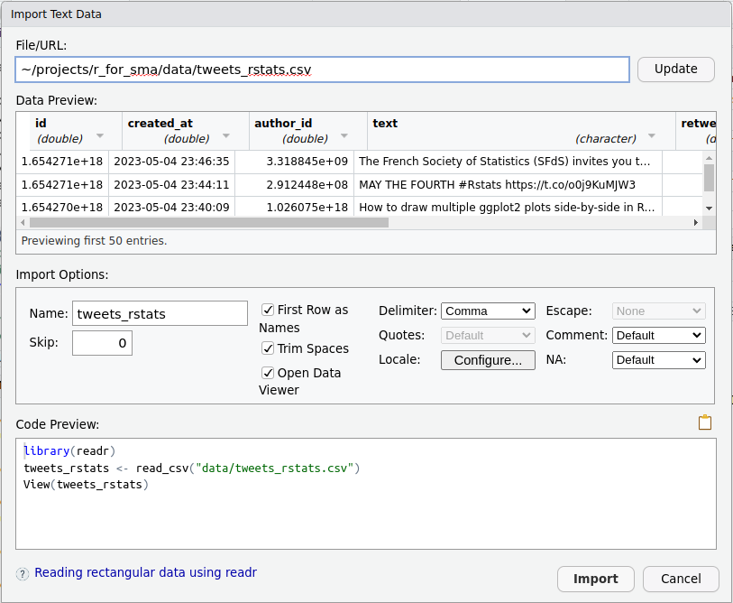

```{r opts, echo = FALSE}
knitr::opts_chunk$set(message=FALSE, warning=FALSE)
```

VU Amsterdam

# This practical

In this practical you will learn how to import your own data into R and use a number of text analysis techniques to explore and visualize the content.
The first part of this practical is mostly a tutorial.
The second part contains the assignments, but these will be hard to make if you did not complete the tutorial.


# Gathering Social Media data

The first step in social media analysis is to collect the data.
The good news is that you can also use R as a data collection tool!
The bad news is that data collection can be difficult and time-consuming, especially if you want to do it for free.

In this course we will provide you with data, but it is still important to know a bit about how data collection usually works.
Also, for the final assignment in Period 6, you can decide to collect our own data (but this is not required).

There are three common ways to collect social media data:

* using an API
* using web scraping
* Buying Social Media data

## API

**API** stands for Application Programming Interface. Simply put, an API makes it easier for different application to talk to each other. For example, if you have an application on your phone for editing photo's that also allows you to immediately post these photo's on Twitter, it likely uses the Twitter API. The reason this is interesting for Social Media Analytics is that you can often also use an API to collect data. For example, Twitter has an [Academic Research API](https://developer.twitter.com/en/products/twitter-api/academic-research) that allows researchers to query 10 million tweets per month from the entire Twitter archive. Similar types of API access exist for companies, but these are often not free to use. 

Here is an example of how the Twitter API would work. Do not try to run this example yourself, because you would need to register for the Academic Twitter API. This is only possible for Master students or University employees. Sadly, it's is also possible that the Twitter Academic API will get closed done soon or at least no longer be free to use, because Twitter is changing a lot now that it's owned by Elon Musk. The following example is just to demonstrate how API's can make data collection easy. One of the reasons R is so popular for data science is that there are often packages for working with these APIs  

```{r}
# don't try to run this code, because it doesn't work if you're not registered for the Academic Twitter API.
library(academictwitteR)

# This code collects the most recent 50,000 tweets about rstats (a common way to refer to R) in 2023.
tweets = get_all_tweets(
  query = "rstats",
  start_tweets = '2023-01-01T00:00:00Z',
  end_tweets = '2023-05-05T00:00:00Z',
  data_path= "data/rstats",
  lang='en',
  n=50000,
  is_retweet = FALSE,
)
```

## Web Scraping

Another method for collecting data from the internet is to create a robot that visits websites and collects the data for you. This is a more time consuming method than using an API (and can have some ethical and legal issues), but it allows you to collect data if no API is available. These robots are often called **Web Scrapers**. You can create your own web scraper in R, but this does require a bit more experience in R than we cover in this course (Though if you're interested, we do have an (introduction video)[https://www.youtube.com/watch?v=9GR26Y4z_v4]).

There are also packages in R that can do the web scraping for you. For instance, the RedditExtractoR let's you search for threads and then collect all comments in the thread. You can run the code below yourself. Just remember to run `install.packages("RedditExtractoR")` first.

```{r}
library(RedditExtractoR)  

## search for threads about rstats in the last week (a common way to refer to R)
threads = find_thread_urls("rstats", period='week')
View(threads)
threads$title

## get thread and comments for the first thread that we found
first_thread = threads$url[1]
content = get_thread_content(first_thread)

View(content$threads)
View(content$comments)
```

## Buying Social Media data

If you work for a company that has plenty of money it can sometimes be worthwhile to pay another company to collect the data for you.
Off course, this is not *really* a data collection method. 
You're just paying someone else to do the work for you.
We only mention it because it can be a viable option if you're a small company or research team.

An important thing to consider is whether you're buying *data* or paying for an analysis tool.
Some companies provide you with the raw Social Media data, that you can then analyse yourself.
In this case you mainly need to verify that the data they provide is complete (remember the precision and recall of search queries that we discussed in the third practical).
There are also companies that provide a *Social Media Dashboard* to analyse the data, and it is not always possible (or restricted) to download the data yourself.
The problem is that this leaves you blind regarding the reliability and validity of the data.
So if you're working with a social media dashboard, make sure to always request proof of the validity and reliability, such as intercoder reliability tests, precision and recall.


# Reading CSV files into R

In this course we will provide the Social Media data using `CSV` files.
`CSV` stands for Comma Separated Values, and it's is one of the most common formats for storing data in a `data frame` format. 
That is, data in which we have rows and columns.
You are probably most familiar with this type of data representation from Excel or SPSS. 
In the most typical use case, rows represent cases in your data (e.g., survey participants) and columns represent variables (e.g., age, gender).
In our current case, each row in our data is a tweet, and columns contain information about this tweet, such as the author and the text.

So why do we use `csv` files instead of something like Excel? 
The main reason is that a `csv` file is plain and simple.
Excel files have all sorts of bells and whistles, which makes them nice to work with, but also prone to get messy when we just want to store data.

* When you try to download the file from Canvas, some computers might immediately ask you whether you want to open it in Excel (or a similar program on Mac). Do not do this, but instead download the file directly to your computer. If you open the file in Excel and then save it, it might already have messed up the data.
* There are different types of CSV files (yes, life is complicated). Most importantly, there are two common versions that you should know about. In this tutorial we'll only use the most common one, and we'll use the other one next time. 

For reading csv files into R, we're going to use the `read_csv` function from the `readr` package.
R also has a built-in function called `read.csv` (with a dot instead of an underscore), but the `read_csv` function from the `readr` package is faster and overall nicer. 
We'll first need to install `readr` (remember that you only need to do this once)

```{r, eval=F}
install.packages('readr')
```

And now we can use `library` to use the package in our current session.

```{r}
library(readr)
```

## Importing the tweets_rstats.csv file

We're going to import the CSV file called `tweets_rstats.csv` that you can find on Canvas under this week's assignment.
This is the data that we collected from Twitter using the Academic API, as shown above.

You can use the `read_csv` function by providing it with a string for the location of the file on your computer.
This will look something like the following code, but you'll have to replace the string with the location on your own computer.
If you can't figure out how to do this, keep reading, because we'll provide an alternative solution!

```{r}
tweets = read_csv('~/projects/r_for_sma/data/tweets_rstats.csv')
```

### Using RStudio to import the file 

Many of you are probably not familiar with this way of specifying the location of a file.
Don't worry though! RStudio can help you with that.
In the bottom-right window, you can go to the `Files` tab.
Here you can browse to the file on your computer. 
Then when you click on the file, RStudio will understand that it's a CSV file, and give you the `Import Dataset` option. 
If you click "Import Dataset", then you'll get a window for importing the data.

```{r, echo=F, fig.align='center'}

```

DO NOT YET CLICK ON THE `IMPORT` BUTTON!
This would import the file, but the better approach is to copy the code for importing the file and doing it yourself.
At the top of the window you'll see a Data Preview, which tells you how it would import the data frame.
Since tweets_rstats.csv follows the standard format, this should all look good. 
At the bottom (right) you should see the `Code Preview`. 
Copy this code and close the window by pressing the `Cancel` button.

Now you can copy this code into R, which will look something like this, but the part between quotes should now contain the location of the file on your own computer.

```{r}
library(readr)
tweets_rstats <- read_csv("data/tweets_rstats.csv")
View(tweets_rstats)
```

Only the second line is really important here (assuming you already opened the `readr` package earlier). 
Note that by default RStudio will import the data using the name of the file, which in this case is `tweets_rstats`.
So for now you'll want to change that into `tweets`, because that's how we called it above.
(So not `tweets_rstats <- ...` but `tweets <- ...`)

## Look at the Twitter data

Now that you've imported the Twitter data, a good first step is to have a good look.
You'll need to know a bit about what types of information you have about each tweet.
A good way to do this is by using the `View` function (what RStudio also gave you when importing the data).

```{r}
View(tweets)
```

Looking at the data, you'll see that for every tweet we have the text and engagement statistics (likes, shares, etc.), and some other stuff that we won't use here (created_at, author_id).

# Analyzing the Tweets data

We'll first re-cap the techniques that you worked with before, but this time using our tweets dataset (so make sure to follow the steps above for importing the tweets data)
This time, we'll take some more time to talk about what is actually happening in the code.
The first step is to open the required libraries.

```{r, cache=TRUE}
library(quanteda)             
library(quanteda.textstats)   
library(quanteda.textplots)
```

Last time we used the `data_corpus_inaugural` data. This is a demo dataset included in `quanteda`.
This time, we bring our own tweets data.
Our first step is to tell R that our data.frame of Tweets can be seen as a `corpus` (i.e. a collection of texts).

## Creating the corpus 

We can create a corpus with the aptly named `corpus` function.
The only thing we need to add in this function, is that we tell it that the `text` column in the twitter data contains the text.

```{r}
corp = corpus(tweets, text_field = 'text')    
corp
```

Looking at the corpus object, we see that it has 50,000 documents (tweets) and 8 document variables (docvars).
Remember that you can use the `docvars(corp)` function to view the document variables.
This would show you that for every tweet we know some engagement statistics (likes, retweets, replies) and more.

## Tokenizing the corpus 

Last time we saw that we can create a wordcloud from a corpus. 
Let's do this again, but take it a bit more slowly to see what is actually happening.
The first thing we did was use the `tokens()` function. 
This function `tokenizes` the text, which simply means that it breaks the text up into words.
We can also provide some additional arguments, such as removing the punctuation (dots, commas, etc.).

```{r}
t = tokens(corp, remove_punct=T)
t
```

When we look at `t` we see the tokenized corpus. 
It looks pretty similar to `corp`, but this time the texts have been split into words.
**Tokenization** is a fundamental step in text analysis. Computers cannot understand language, but they are very good at counting words. 

## Creating the Document Term Matrix

The next step, that we also performed last time, is to create a `Document Term Matrix` (DTM).
This is a matrix in which the rows are documents, the columns are words, and cells indicate how often each word occurred in each document.
In `quanteda` we create this matrix with the `dfm` function. 
In case you are wondering why the function isn't called `dtm`: quanteda uses a slightly more general (but less common) term of a `Document Feature Matrix`. 

```{r}
dtm = dfm(t)
dtm
```

When we look at the `dtm` we see something similar to the tokenized corpus `t`. 
We still have our 50,000 documents and 8 docvars, and the texts are still broken into single words, but this time we have counted the words per document.
This has two major implication:

* The cool thing is that we have now successfully transformed texts into numbers that we can perform calculations with! We can sum up the numbers in the columns to get the total frequencies that we need to create a wordcloud. We can also use statistics like cosine similarities (similar to correlations) to see which words and documents are similar. And many more things. 
* The not so cool thing is that we have just thrown away any information about the order of words. We now longer know that the word "Society" came directly after the word "French" in the first document. We only know how often both words occurred.

This second implication is **very important to understand**, because it tells you something about what you can and cannot do with a DTM.
It turns out that even without knowing the positions of words, we can still do many useful things.
For example, the mere frequencies of words are often sufficient for determining the topic of a text.
But imagine that you have the text "Steve was angry at Bob". 
After transforming this text into a DTM, it becomes impossible to say whether Steve was angry at Bob, or that it was Bob who was angry at Steve.

To remind us of this limitation of the DTM representation, it is also referred to as a **bag-of-words** representation.
The take-home message is that DTM's are very useful for performing automatic content analysis, but certain types of content analysis are not accurately possible with them. 

## Preprocessing 

In the current DTM we still included all words as they originally occurred in the corpus.
This has important consequences:

* Some words are much more relevant than others for certain types of analysis. If we want to learn something about the topic of a text, we are for instance not interested in very common words like `the`, `it` and `to`. These types of words are also referred to as `stopwords`. Last time, we therefore removed these stopwords before creating a wordcloud.
* Our DTM does not know anything *about* the words, so it doesn't understand that words like `cat` and `cats` have a very similar meaning. A simplistic but sometimes effective solution is to `stem` the words. This tries to reduce words to their `stem`, so that `cats` becomes `cat`. However, simple stemming algorithms are pretty dumb, so they also mangle words like `societies` into `societi`. 

You already saw how to remove stopwords last time. This time, look close at the columns to see that this simply removes the English language stopwords. 

```{r}
dtm = dfm_remove(dtm, stopwords('en'))
dtm
```

Stemming is just as easy. Just use the `dfm_wordstem` function. Notice that some words now look rather ugly, but the total number of unique features (i.e. words) is reduced from 90,814 to 84,231. 

```{r}
dtm = dfm_wordstem(dtm)
dtm
```

## Creating the wordcloud

Now we are finally ready to create the wordcloud.

```{r}
textplot_wordcloud(dtm, max_words = 40)
```

We see that this wordcloud mainly contains hashtags.
This makes sense, because hashtags are designed to make people use the same terms.


# Assignment 1: Analyzing Twitter

> **Question 1.a**.
> Produce the wordcloud from the "Analyzing the tweets data" secion. Include the code and the wordcloud itself.

> **Question 1.b**.
> Interpret the wordcloud. What does this tell you about the tweets that mention `rstat`?

Last time we used `dfm_subset` to make a wordcloud just about Obama (`President == Obama`). 
In the current data we also have information about the number of likes for each tweet, which we can use to subset data on only tweets that received at least 100 likes (`likes >= 100`).

> **Question 1.c**.
> Create the wordcloud that only uses tweets with at least 100 likes. Include the code and the wordcloud in your answer.


# Assignment 2: Analyzing Reddit

You work for a big company, and are asked to set up a system for monitoring whether and how your company is discussed on Reddit.
As a starting point, you decide to scrape any new threads in the past month. *Note: you don't have to get the comments from the threads, just the titles (otherwise it takes quite long to download)*

> **Question 2.a**.
> Pick a big company or brand (big enough that people would talk about it on Reddit). Collect threads from Reddit in the past month that mention the company, and make a corpus from the titles (`threads$title`).

> **Question 2.b**.
> Create a Document Term Matrix and perform preprocessing. You can yourself decide what preprocessing steps to perform (e.g., removing punctuation, removing stopwords, stemming, subsetting). In addition to providing the code, justify any decision that you made in the preprocessing.

> **Question 2.c**.
> Make a wordcloud from this corpus.

> **Question 2.d**.
> You realize that the threads also mention the subreddit category. Make a wordcloud of the subreddit categories


# Writing better code with pipes

When we create a DTM, it's quite inconvenient that we need to first create a corpus, then create the tokens, and then create the DTM.
In particular, it feels unnecessary that we *have* to give names to the corpus and the tokens if we're only interested in the DTM.
And indeed, this actually is unnecessary, and can be avoided by working with `pipes`.

Look again at the following code.

```{r}
corp = corpus(tweets, text_field="text")
tok = tokens(corp)
dtm = dfm(tok)
```

Ideally, we would just provide the `tweets` as input and receive the `dtm` as output, without having to create `corp` and `tok`.
This can be achieved with the `%>%` (pipe) operator, which allows us to create a pipeline of functions.

```{r}
dtm = tweets %>% 
  corpus(text_field="text") %>% 
  tokens() %>% 
  dfm()
```

With this notation, it is immediately clear that these lines of code belong together as a single operation, and no needless names are created.
You can even put parts of the pipe on the same line if you like.

```{r}
dtm = tweets %>% corpus(text_field="text") %>% tokens() %>% dfm()
```

So how does this work? Basically, you should read the pipe operator as `input %>% function`.
The data that comes before the `%>%` operator will be plugged into the function *as the first argument*.
Here are some examples.

```{r}
input = "Example text."

## Pass input to the tokens function
tokens(input)
## Do the exact same thing with a pipe
input %>% tokens()

## Pass input to the tokens function with an additional argument
tokens(input, remove_punct = T)
## Do the exact same thing with a pipe
input %>% tokens(remove_punct = T)
```

You might be wondering why we have two ways of doing the same thing.
The reason is that readability of code is just as important as functionality.
The pipe is not meant to tell R what to do.
The pipe is meant to make it more obvious to a human what the code is doing.
In programming this is also called `syntactic sugar`.

We avoided talking about pipes until now because when you're just getting started 
it's annoying if you have to learn multiple ways to do the same thing. But pipes
can really help you write better code, and if you look up code online you will often
see people using pipes. So it's best to learn it sooner rather than later.

# Assignment 3: Working with pipes

> **Question 3.a**.
> Rewrite the code from question 1.a (from the `Analyzing the tweets data` section) using the pipe syntax.


# Assignment 2

Now you're going to combine all that we've discussed to conduct your own little exploratory analysis.
For this assignment you'll investigate how people on Twitter talked about a certain person, organization or topic.
Given the limitations for exporting data from OBI4wan, you'll have to focus on max. 1 week of messages.
This doesn't have to be a special week. 
You could for instance just ask: `"how did people talk about Mark Rutte in the past week?"`. 
Still, for your analysis it's easier (and more fun) to pick a person/organization/topic where something interesting happened within this week.

You will collect the data yourself from OBI4wan, using the trick described in `Getting more data from OBI4wan`.

* Make sure to filter sources so that you only look at Tweets. 
* If there are more than 20,000 messages on a day, you can just download these 20,000 messages and ignore the rest (so you won't have to query on shorter time periods).
* You should focus the analysis on a period of max 1 week, but you can also focus on a few days. 

> **Question 2.a**. Pick a person, organization or topic and create a query. Perform the query to look for all messages in the time period (max 1 week) of your question. Report what you will investigate, and provide the query and number of messages in your answer.

Now you're going to download the results per day from OBI4wan, import them into R, and perform a wordcloud and topic model analysis. 
We summarize the code here.
Remember that you can navigate to the file in the file window (bottom-right corner of RStudio) and click on the file to get the location, and that you need to use `read_csv2` instead of `read_csv` to import it correctly.

```{r, eval=F}
## load the packages
library(dplyr)
library(readr)   

## import the data into R
## (maybe you'll need more lines, if you have more files)
d = bind_rows(
  read_csv2("location_on_your_computer/file_from_obi4wan.csv"),
  read_csv2("location_on_your_computer/another_file_from_obi4wan.csv"),
  read_csv2("location_on_your_computer/yet_another_file_from_obi4wan.csv"))

## check whether it worked
d
```

Now you can see whether it worked. If successful, the output should show you the top rows of the data frame (here called a tibble, which is a special type of data frame). It also shows you how many rows and columns you have: `# A tibble: [rows] x [columns]`.

> **Question 2.b**. Make a screenshot of the output and paste it in your answer document. 


Now you can create the DTM and perform the analysis.
We again provide you with the code. 
However, you might have to change some parts yourself.
`stopwords` are currently English, so set them to Dutch if you have Dutch data).
Also, if you run OBI4wan in Dutch, then the columns in your data might be in 
Dutch as well. So in the `corpus()` function you might have to use
`text_field = "Bericht"` instead of `"Message"`.
You can also choose whether or not you want to use *stemming* (`dfm_wordstem`), and **we will ask you about this choice in the assignment**.
Furthermore, you can get points for doing things better, such as adding colors to the wordcloud, and changing some settings for training the topic model (for which there are hints in the section on topic modeling).

```{r, eval=F}
## load the packages
library(quanteda)             
library(quanteda.textplots)
library(stm)

## creating the DTM
corp = corpus(d, text_field = 'Message')    
dtm = dfm(tokens(corp, remove_punct=T))

## some preprocessing
dtm = dfm_remove(dtm, stopwords('en'))    ## or stopwords('nl') for Dutch
dtm = dfm_wordstem(dtm)

## making a wordcloud
textplot_wordcloud(dtm, max_words = 50)

## training a topic model
dtm_trimmed = dfm_select(dtm, pattern='@*', selection='remove', min_nchar = 3)
dtm_trimmed = dfm_trim(dtm_trimmed, min_termfreq = 2500, termfreq_type = 'rank', 
                                    max_docfreq = 0.5, docfreq_type='prop')
m = stm(dtm_trimmed, K=10, max.em.its = 20)

## analyzing the topic model
plot(m, n=5)
cloud(m, topic=1)
cloud(m, topic=2) # etc.
```


> **Question 2.c**. There are advantages and disadvantages to `stemming` data (as discussed in the video lecture). You could now choose whether or not to use stemming (whether or not you used `dfm_wordstem`). What did you choose and why. (hint: both stemming and not stemming can be correct. The question is purely about your justification for the choice.)

> **Question 2.d**. Report and interpret the wordcloud. Does it give you a clear idea of what the tweets are about?

> **Question 2.e**. Report and interpret the topic model. Describe 2 topics with the clearest interpretation (based on the model plot and the topic wordclouds). Does it help you get a better idea of what the tweets are about? 

> **Question 2.f**. You work for a social media dashboard company, and they just implemented topic modeling as a new feature. Before, they just showed a single wordcloud based on the total frequences of words in a collection of texts. Now, they also give the option to show "topic word clouds" for each topic found by the topic model. However, users have a hard time understanding how to use this new feature. You are asked to write a non-technical explanation for what these "topic word clouds" are, and how they can use them. 

