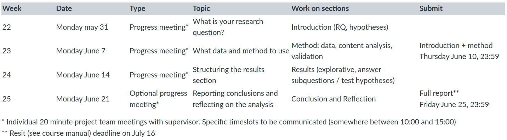

```{r opts, echo = FALSE}
knitr::opts_chunk$set(message=FALSE, warning=FALSE)
```

VU Amsterdam

# This practical

Due to the whole Corona situation, we made a minor switch in the topics of the final practical and lecture. 
Instead of spending the final practical on repeating the techniques you learned in R, and talking in the lecture about the final assignment, we now spend this practical on writing a sketch version of the introduction and method section of the research report that you'll write in P6. 
The questions in this practical correspond to the key components of these sections, and will help you write them step-by-step.
As such, this practical serves as both a trial run and as a detailed assignment description for the (graded) progress update on June 10th (see schedule below).

This doesn't mean that you already have to make important decisions, such as your definitive research question.
Researcher is an iterative process that seldom succeeds in one go. You come up with an idea, work it out a bit, then take a step back and try again.
In this assignment we'll provide some pointers for going through this motion. 
You are also allowed to use all your answers and ideas from this assignment in your actual research report.

The reason for this change is that it gives more time for supervisors and teams to discus the final assignment.
It should ease the start-up of P6 and could even give you a head start.
This way we can somewhat compensate for the limited means of interaction. *(Sidenote: we are looking into whether we can offer the option to have on-campus supervision meetings in P6, but we can't yet make any promises.)*.
At the same time, we thought the `recorded lecture` format actually lends itself better to summarize the techniques that you learned. 
This lecture will now include shorter videos with mini tutorials (+ code examples) for performing the types of analysis that you could use in your research report. 

Our hope is that this change will offer you a bit more peace of mind about the research report in P6. 
Last year we also taught this part of the course within the Corona pandemic, and that really did work out very well, so we're confident that we can make this an inspiring project.
But we also see (and feel) the struggle to keep motivated as the summer and a return towards normalcy finally approach. 
So hang in there for a little while longer!


## Prelude to final assignment

Your final assignment in P6 is to write a research report, for which you'll work through a full research cycle of coming up with a research question, collecting the data, performing the analysis, and drawing conclusions. 
Each week you'll write one of these components, and every Monday you'll meet up with you supervisor to discuss progress and ask questions.

```{r, echo=F, fig.align='center'}

```

All research papers share a common structure, usually revolving around the sections: introduction, literature overview, method, results, conclusion/discussion. But there are some variations to this theme, relating to the field of research (e.g., media psychology, political communication, marketing, corporate communication) and methodology (e.g., experiment, survey, content analysis).
In the project in P6, you will conduct a content analysis of social media data, and you will learn what the key components of a research report are in a content analysis study.
We focus less on literature and more on method, in line with the more methodological focus of this course.
In this practical we'll dedicate our attention to the introduction and method section. 

# The introduction section

In the introduction section you need to explain to the reader what your study is all about. Although there is quite some freedom in how to approach this, there are some common components that need to be in there. For your research report, the following components are most important. 

### Introduce the topic
Start the introduction with a short lead in which you introduce the main topic. Don't just start with: "in this study we investigate ...", but pull your reader in first. For example, imagin that your study is about [the debate on April 1 about the leaked notes from the Dutch cabinet formation process](https://nltimes.nl/2021/04/02/pm-rutte-survives-debate-formation-leak-image-severely-damaged), and how this affected public opinion about Mark Rutte. Your first paragraph should then convince your reader that this was indeed a key debate for Mark Rutte, and well worth investigating. In that sense it could be similar to the first paragraph of the news article.

### Research question
A study should have a clear overarching question. The main purpose of this question is to help your readers understand what they will learn by reading your report, as well as help yourself focus in writing the report. 

Writing a good question is a bit of an art, but there are [some guidelines](https://writingcenter.gmu.edu/guides/how-to-write-a-research-question). 
An important thing to keep in mind is that this overarching research question is broader then the specific questions that you answer in your analysis (this is what the (sub)questions and hypotheses are for). 

For example, a paper might say: "In this study we investigate how the parliamentary debate about the leaked notes from the Dutch cabinet formation process affected public opinion of Mark Rutte". 
This makes it sufficiently clear what the main goal of the paper is.
It doesn't yet have to specify how this study contributes to answering this question.
Later on you can clarify that you analyze public opinion based on how people talk on Twitter, and that you mainly focus on whether people are positive or negative (which tells us something, but certainly not everything, about public opinion).
In short, the research question should clearly communicate the main goal of the study, but doesn't yet have to contain all the details. 

### Method
The introduction section should also mention the method.
This shouldn't yet contain the details (that's what the method section is for), but it should clarify your general approach.
You first of all want to mention the type of research method (content analysis, experiment, survey, interview, etc.).
In this project, you'll want to specify that you used content analysis (as opposed to an experiment, survey, etc.), and more specifically automatic content analysis (as opposed to manual content analysis).
Since we use content analysis, you should mention what content you analyze (e.g. tweets about Mark Rutte within a week before and after the debate), and what the main concepts are that you'll be measuring (e.g., sentiment and topics). 
Note that you can often summarize this key information quite compactly: "we used automatic content analysis to analyze the sentiment and topics of tweets about Mark Rutte in one week before and after the debate".

The hard part (again) is to distinguish key information from details.
For instance, you should mention that you used social media data, but you don't yet have to explain how you got it (e.g., via OBI4wan), and you certainly shouldn't yet mention the specific query that you used.
You should mention what types techniques you use (e.g., topic modeling, dictionary), and you can be somewhat specific (e.g., that you use the STM topic model, or NRC sentiment dictionary), but you don't describe specific choices (e.g., whether you used stemming).

Finally, it is often good to say something about why this method makes sense for this study. 
Different methods have different pro's and con's, and you might want to spend a sentence or two to convince your reader of why your method is a good choice.
For instance, if you study public opinion using a sentiment analysis on Twitter, you could refer to other studies that have done something similar (tip: search on Google Scholar for `twitter public opinion analysis`)

All of this typically goes into a single paragraph, so keep it snappy, and think hard on what they key information is.

### Relevance
It should be explained why the study is relevant (even if you think the relevance is obvious). In scientific studies relevance is typically theoretical and/or societal. But research can also serve a more practical purpose, for instance for a specific organization. For the final assignment you are allowed to choose whether you focus more theoretical, societal or practical relevance, and you can pretend that this is a study performed for a certain organization (e.g., a company, NGO, political party). 

Also, you don't have to worry much about novelty for this assignment (as will for instance be a criterion for your master thesis). You don't have to search for 'holes' in the literature, and it's not a problem if your study addresses a very similar question as an existing study. 


### Questions and hypotheses
The overarching research question is typically very broad, so researchers formulate more specific (sub)questions to answer and hypotheses to test. For example, to investigate how the debate might have affected how people think and talk about Mark Rutte, we can more specifically measure: `(RQ1) What are the main topics of Twitter messages about Mark Rutte in the week following the debate`. We can also formulate very specific hypotheses about how the way people talk about Mark Rutte on Twitter changes due to the debate. Based on theory (and a bit of common knowledge), we can expect that `(H1) Tweets about Mark Rutte one week after the debate are on average more negative compared to one week before the debate`.

Normally these are often formulated in a separate **theory** (or literature) section, but for the final assignment you won't have to write an extensive theory section, and can include the questions/hypotheses in the introduction. We strongly advise formulating at least one explorative question, and one hypothesis. 


> Note that you are required to use academic literature (at least 5 papers or books). The most obvious parts of the introduction to include this are the *relevance* and *questions / hypotheses*. You can also refer to sources about methodological techniques, such as providing a reference for Structural Topic Models (if you use them), or studies that argue how social media analytics can be used to study public opinion.


## Assignment 1

For the first assignment, you'll answer some question to create a rough sketch for an introduction.
This has to be an introduction for a study that you would be able to conduct with the techniques that we discussed in this course, and data that you could collect from OBI4wan.
You are allowed to (but don't have to) use this sketch as a starting point for the final assignment in P6, so doing it well now can pay off twice.

The first step is to come up with a topic and research question. 
This is immediately the hardest step, so let's first discuss some useful guidelines.
Research questions tend to have rather standard `formats`.
Given certain types of research methods, there are certain types of questions that you can ask. 
The following is a very flexible format for using social media data to study public opinion. 

* How did <font color='red'>[event]</font> affect <font color='purple'>[public opinion]</font> about <font color='blue'>[person / organization / issue]</font>. 

It doesn't have to be strictly this sentence. The format is simply that we can study how `some event` has changed `how people feel, think or talk` about `something or someone`. 
Here are some examples of alternative questions with the same format (using nonsense placeholders to not steal any ideas you might have):

* How did <font color='red'>[the fall of the Berlin wall]</font> affect <font color='purple'>[attitudes]</font> towards <font color='blue'>[walls]</font>?
* Did people become <font color='purple'>[happier]</font> about <font color='blue'>[cats]</font> since <font color='red'>[the Corona lockdown]</font>? 
* To what extent has <font color='red'>[the robot apocalypse]</font> changed <font color='purple'>[how people feel]</font> about <font color='blue'>[chat bots]</font>?

Some additional things to keep in mind:

* Pick a recent event, because you can only get up to 1 year back on OBI4wan.
* Events can also be communication, such as the start of a marketing campaign or a political statement. 
* Public opinion should be interpreted very broadly here. It can also be about emotion, and for some questions it might also be very interesting to look at how the public agenda (the amount of social media messages) changes.
* You are free to not use this format, or a variation on this format.

Now then, let's start sketching an introduction.  

> **Question 1.a**. Come-up with a topic and introduce it. (tip: if you used the event-oriented format, this will typically be a paragraph saying what happened, and why this could impact public opinion).

> **Question 1.b**. Formulate the overarching research question.

Now, let's add the method and relevance parts. At this point you can't yet be very specific (since you haven't worked out the method yet), but for a sketch introduction you can already write down the general approach (using social media data). 

> **Question 1.c**. Write down `how` you will answer your question. Make sure to mention what data you'd use (time before and after the event, just tweets or also other), and what techniques you (think you'll) use. (tip: if your question is about an event, we recommend collecting data before and after the event for comparison, and in general we recommend using only Twitter data for sake of simplicity)

> **Question 1.d**. To sketch the relevance of your study, you make a bulletpoint list mentioning `theoretical relevance`, `societal relevance` and `practical relevance`. For each point describe whether and how your study would be relevant. In case of practical relevance you should also mention for whom it is relevant. 

For the final part, you're going to come up with at least one sub-question and one hypothesis. For the hypothesis you do not yet have to justify it with literature. The goal is to think of (and show us) how you could break your research question down into smaller components that you can study. 

> **Question 1.e**. Formulate at least one specific question and one hypothesis based on your overarching research question. 


# The Method section

Where the introduction section has a more creative touch to it (it needs to both inform and pull in the reader) the method section is generally more structured and rigid. One of the most important goals of the method section is transparency and reproducibility. Simply put, it should provide the information that other researcher would need to replicate your study. 

Importantly, you should focus on describing what you did, but you should not describe in extreme detail `how` you did it. 
In particular, you should describe the method, and not the specific tool that you used.
This also means that you should not discuss R in your methods section (you will include your R code in the appendix). 
For example, if you use Topic Modeling you SHOULD say whether or not you applied stemming, but you should NOT say that you used the `dfm_wordstem` to do this. 

For the final assignment, we strongly recommend dividing the method section into three subsection: *data*, *content analysis*, and *validation*. 

### Data

In the data subsection you very clearly describe what data you use. 

* Where you got the data from (OBI4wan)
* What time period 
* What sources (we recommend just using Twitter)
* What query you used. (report the EXACT query. If its super long, you can put in the appendix). 
* If you had to take a sample, you should mention how you did this. Remember that you can only download 20.000 messages from OBI4wan at a time. You can quite easily separate your data into multiple smaller time periods to collect more (as we did in the fourth practical), but there are still limits. If you find more than 100.000 tweets, you are allowed to take a sample.
* What is the total number of messages in your data

### Content analysis

In the `content analysis` section, you need to explain how you have actually measured the abstract concepts that you used in your questions and/or hypotheses.
Take the following hypothesis: `Tweets about Mark Rutte one week after the debate are on average more negative compared to one week before the debate`.
The abstract concept here is "more negative".
To test this hypothesis, you need to describe how you turn this abstract concept into something that you can measure.
This process is also called operationalization. 

The first step here is to clarify what "more negative" means to the researcher. 
For instance, does this mean that people are negative *about* Mark Rutte himself? Or is something like "ahh, poor Mark Rutte" also negative?
The second step is to describe what technique the researcher will use to measure this. 
If any kind of negative emotion will do, then a sentiment dictionary might be a viable option. But if we're specifically interested in whether the author of a message voices a negative opinion about Mark Rutte, then we might need a more sophisticated tool that can distinguish to whom negative sentiment is targeted. We could still use a sentiment dictionary, but we might then find many false positives like "It was a terrible day for Mark Rutte". 
By clearly relating what you're trying to measure to what measurement technique you use, your reader can better understand (and judge the validity of) your analysis.

Note that sometimes the question or hypothesis already mentions how you measure something, but that doesn't mean that you're not interested in measuring some more abstract concept. For example, you might have a question about how much the number of tweets about a company increased after launching a certain campaign. But in this case you're probably not actually interested in the number of tweets, but rather what this tells you about public interest in the company. So even if it might feel obvious, you should make sure that you distinguish what you're substantively interested in from how you measure it.


> Tip: Thinking about operationalization can also help you develop research questions and hypotheses. Not all abstract concepts that we can think of can be turned into measurable observations, so when we design a study we also need to think the other way around: given the measurable observations that we can obtain, what abstract concepts can we actually measure? For the final assignment, you should think hard on what techniques you now learned in this course for performing certain measurements, and how this let's you answer certain types of questions and test certain types of hypotheses.   


### Validity

Validation is the logical next step after operationalization.
Above you clarified how you're going to measure certain abstract concepts.
In the validation section, you're going to show how good these measurements really are.
Very concretely, what this means is that you're going to calculate precision and recall scores.

Now, we won't ask you to validate EVERYTHING, and we'll also keep the amount of messages that you need to manually code moderate. 
The reason is simply that doing manual coding for validation is time-consuming, and we would rather have you direct your energy elsewhere. 
However, we do emphasize that in a proper study validation should not be skipped, and when you read a research report with an automatic content analysis component you should always read the validation section (or worry when it's absent).

Specifically, you'll need to perform two separate precision and recall measurements in your final paper[^1].

[^1]: It might happen that in your final assignment you perform your validation, and come to the conclusion that your measurement is pretty much useless. 
This doesn't automatically mean that you did something wrong, and you won't have to redo everything. 
An important learning goal of this course is to realize that the validity of a (computational) measurement should never be taken for granted.
It can always mess up, and should always be tested.
Normally, finding out that your precision and recall are not good enough would mean that you'd have to go back to the drawing board to improve your measurement tool or forfeit your study, but for this assignment this is certainly not required.
Even if your precision and recall turn out to be hilariously low, you can simply continue with your study as if nothing is amiss. 
You will be graded on how well you demonstrate your understanding of how to conduct good research, and good researchers can still end up with cases of low precision.
What matters is that you show us that you understand the limitations of your study, which you can do in the `reflection` section of the assignment.

* You need to perform a precision and recall measurement for `the most important measurement` in your study (discuss with your supervisor if it's not clear which measurement this is). For example, if your main question or hypothesis is based on sentiment analysis, then perform the P&R measurement for this sentiment analysis. For this measurement every team-member should manually code 25 messages (so with 5 members, you'd end up with a gold standard of 125 messages). 
* You need to perform a precision measurement (no recall) for your **population query**. That is, the query that you use in OBI4wan to retrieve the messages. Here you manually code 100 random messages from the OBI4wan results to calculate the precision. (this is the same calculation as you used in assignment 2.d of the 2nd practical)


## Assignment 2

In this assignment we'll sketch the method section based on the idea that you developed in assignment 1. 

> **Question 2.a**. Develop a query to collect your data from OBI4wan. Report the query, the time period and the source type (again, we recommend only using Twitter). Write this as you would write it in your research report. 

> **Question 2.b**. Report the number of messages that you find. Now, think about how you could export these messages to R, keeping in mind that you can only export 20.000 messages at a time. Would you be able to use all messages, or would you have to take a sample? If so, how would you draw this sample?


For the content analysis section you'll now only have to discuss one measurement from either the question or hypothesis that you formulated in `question 1.e` (in the final assignment you'll need to discuss the measurements of all your questions/hypotheses). 


> **Question 2.c**. Report what question / hypothesis you used. Describe what you need to measure to answer or test this question or hypothesis.

> **Question 2.d**. Now describe how you'll actually measure it, and reflect on how well you think this will work. In this stage (we're still sketching), you don't yet have to make a definite choice. You can say that you are doubting between two methods and reflect on which might work better.


And this brings us to the `validation` part. 
In a proper study, we don't just think about how well our method actually measures what we're trying to measure, but we also test this.
As you've now seen several times, we can achieve this by creating a gold standard based on human evaluations, and then use measures such as Precision and Recall to see how well our automatic content analysis techniques can match this[^2].

[^2]: Note that we're only talking about validating our content analysis techniques.
Take the example of using the number of tweets about a company as an indication of public interest in the company.
We can test whether our method for automatically counting tweets about a company is accurate. 
But we cannot as easily test our assumption that the number of tweets is actually a good measurement of public interest.
As with any research method, we should always be mindful about the the things we simply cannot see, and take this into account in estimating how certain we can be about our conclusions.

You can't actually perform the validation now since we're still just sketching the set-up of our study. 
But you can think about how you will perform the validation eventually.
The following two questions cover the two type of validation that you need to perform in your final assignment (as discussed above)

> **Question 2.e**. One thing that you need to validate is your *population query* (i.e. the query for retrieving your data from OBI4wan). For this you only need to measure the precision. Describe how you would do this. 

> **Question 2.f**. You also need to measure the precision and recall for a measurement used in a question and/or hypothesis. For this assignment, use the same measurement that you described in question 2.c and 2.d. Describe how you would create the gold standard to measure the precision and recall.


# Combining both sections

## Assignment 3

In this assignment you'll practice putting together the different components of the introduction and method section. 
As a starting point, we'll provide you with a *skeleton* in which you can plug the answers to the questions above.
Off course, this patchwork approach is not how one would normally write a research report, and the world would be a boring place if all research reports looked like this.
This is purely an exercise to help you develop a better intuition for what key components you need to address in the introduction and method sections of a (automatic) content analysis study.

The structure is pretty straightforwards, and corresponds to the descriptions above.

* **section: Introduction**
    * question 1.a - 1.e
* **section: Method**
  * **subsection: Data** 
    * question 2.a - 2.b
  * **subsection: Content analysis** 
    * question 2.c - 2.d
  * **subsection: Validation** 
    * question 2.e - 2.f


> **Question 3**. Copy the skeleton structure, and paste in your answers to the questions. Let every teammember read it from start to finish to get a sense of the coherence between the components. Discuss with your team what the strenghts and weaknesses are. Finally, do one round of revision where you tidy up the text into a more coherent whole. Report the final version.
